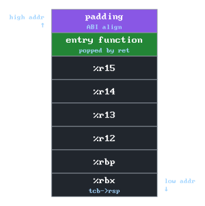
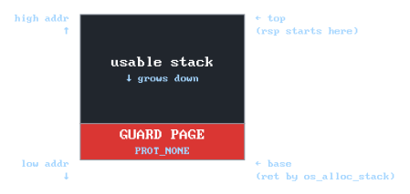
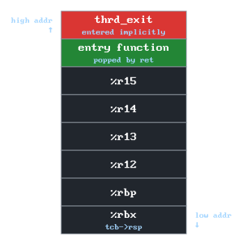

<div align="center">
  <picture>
    <source media="(prefers-color-scheme: dark)" srcset="docs/assets/header_dark.svg">
    <source media="(prefers-color-scheme: light)" srcset="docs/assets/header_light.svg">
    
  </picture>

  <p><em>An educational green threads library written in C.</em></p>

</div>

## Table of Contents

- [Introduction](#introduction)
  - [But what exactly are threads?](#but-what-exactly-are-threads)
- [Quick start](#quick-start)
  - [Hello, Thread!](#hello-thread)
- [Public interface](#public-interface)
  - [Return codes](#return-codes)
  - [Threads](#threads)
  - [Mutexes](#mutexes)
  - [Condition variables](#condition-variables)
- [Implementation](#implementation)
  - [Build setup](#build-setup)
  - [Context switching](#context-switching)
  - [Cooperative scheduling](#cooperative-scheduling)
  - [Thread lifecycle](#thread-lifecycle)
  - [Blocking primitives](#blocking-primitives)
  - [Sleep and the heap](#sleep-and-the-heap)
  - [Preemption](#preemption)
  - [Porting](#porting)
- [Roadmap](#roadmap)
- [Sources](#sources)

## Introduction

Sometimes, as a programmer, you might encounter a situation, where you need to run two or more functions side by side.
Think of a music player that needs to stream audio while updating its UI at the same time, or a web server handling multiple requests at once.
This is where **threads** come in.

### But what exactly are threads?

A **thread** is a piece of code that can be temporarily paused while running, allowing other threads to execute in its place, and then resumed at any future point in time. 
Without threads, a program can run **only one** thing at a time, start to finish, in order. 
With threads, **multiple** tasks can make progress without waiting for each other to complete.

## Quick start

While learning about threads, you might want to write your own code. To build this library, use the following:
```bash
mkdir build && cd build
cmake ..

# build the static library (.a)
cmake --build . --config Release
```
After building the library, you can use the outputted file to link it against your own code, using something like:
```bash
gcc my_code.c libthrd_ndl.a
```

### Hello, Thread!

Below is a basic example on how to use the library.
```c
#include <thrd_ndl/thrd_ndl.h>
#include <stdio.h>

void thrd_a_func(void) {
  for (int i = 0; i < 3; ++i) {
    printf("Hello, Thread A! (%d)\n", i);
    thrd_yield();
  }
}

void thrd_b_func(void) {
  for (int i = 0; i < 3; ++i) {
    printf("Hello, Thread B! (%d)\n", i);
    thrd_yield();
  }
}

int main(void) {
  if (thrd_init() != THRD_SUCCESS)
    return 1;

  thrd_t thrd_a, thrd_b;

  if (thrd_create(&thrd_a, thrd_a_func) != THRD_SUCCESS)
    return 1;
  if (thrd_create(&thrd_b, thrd_b_func) != THRD_SUCCESS)
    return 1;

  thrd_join(thrd_a);
  thrd_join(thrd_b);
}
```
The expected output (for cooperative scheduling) is:
```
Hello, Thread A! (0)
Hello, Thread B! (0)
Hello, Thread A! (1)
Hello, Thread B! (1)
Hello, Thread A! (2)
Hello, Thread B! (2)
```
The code is pretty straight-forward. The two functions that are worthy of a description are:
* `thrd_yield` - voluntarily gives up the thread's turn, letting the next thread run,
* `thrd_join` - blocks the current thread until the passed thread finishes. Notably main has its own, implicitly created thread!

## Public interface

Contrary to other non-educational libraries, this section is here for a different reason.
It's an overview of functions implemented later in the [Implementation](#implementation) section.
While reading the said implementation section, you might return quite often to this section.

### Return codes

Functions that return `int` use these codes:

* `THRD_SUCCESS` - operation completed successfully (always `0`).
* `THRD_ENOMEM`  - out of capacity (pool exhausted, heap full, OS alloc fail).
* `THRD_EINVAL`  - invalid argument (`NULL` ptr, zero size, etc.).
* `THRD_EBUSY`   - resource is held by another thread.
* `THRD_EUNINIT` - passed argument is storing an uninitialized struct.

### Threads

* `int thrd_init` - must be called once before anything else. Sets up the scheduler and creates the implicit main thread. Returns `THRD_SUCCESS` on success, `THRD_EINVAL` if called more than once, or `THRD_ENOMEM` if the underlying OS allocation fails.
* `int thrd_create(thrd_t* out_thread, void (*func)(void))` - creates a new thread. Returns `THRD_SUCCESS` or `THRD_ENOMEM` if the pool is exhausted.
* `thrd_yield` - voluntarily hands control to the next ready thread.
* `thrd_sleep(uint64_t time_ms)` - suspends the current thread for at least `time_ms` milliseconds.
* `thrd_join(thrd_t thread)` - blocks until `thread` finishes.
* `thrd_exit` - explicitly exits the current thread. It's called implicitly when the thread function returns.
* `thrd_dump` - writes a snapshot of the scheduler state to `stderr`, intended as a debugging procedure, safe to call from any thread.

### Mutexes

* `int mutex_init(mutex_t* mutex)` - initializes the mutex, must be called before first use. Returns `THRD_SUCCESS` or `THRD_EINVAL`.
* `mutex_lock(mutex_t* mutex)` - acquires the `mutex`, blocking the caller if already held.
* `int mutex_trylock(mutex_t* mutex)` - attempts to acquire `mutex` without blocking. Returns `THRD_SUCCESS` if acquired, `THRD_EBUSY` if already held.
* `mutex_unlock(mutex_t* mutex)` - releases the `mutex` and wakes one waiting thread.

### Condition variables

* `int cond_init(cond_t* cond)` - initializes the cond, must be called before first use. Returns `THRD_SUCCESS` or `THRD_EINVAL`.
* `cond_wait(cond_t* cond, mutex_t* mutex)` - releases `mutex` and blocks, reacquires on wake.
* `cond_signal(cond_t* cond)` - wakes one thread waiting on the `cond` condition.
* `cond_bcast(cond_t* cond)` - wakes all threads waiting on the `cond` condition.

<div align="center">
  <p><em>Procedures don't return anything unless specified.</em></p>
</div>

## Implementation

This section will serve as a tutorial, split into *sections*, each adding a certain functionality to your threading library.
Each section produces a working library that can be compiled and tested. 
Feel free to experiment after finishing each section.

Up until the last section, [Preemption](#preemption), the library is purely cooperative, meaning that a single thread can run indefinitely, unless explicitly told to stop by calling `thrd_yield`.
This tutorial focuses solely on implementing *M:1* model threading.
That means the whole process of this library runs on one OS thread, creating virtual threads.

The tutorial expects a prior knowledge of the *C* language, as well as a deeper understanding of how the stack works.
An ability to read *assembly* is also recommended. 
The final code can be found in the [src/](src/) directory.
Each section has its source code in the corresponding `layerX` directory.

This entire section will use `x86_64` as the primary example, with the `ARM64` covered at the end.
Similarly, it targets Linux/macOS, the (limited) Windows port is covered at the end, both in the [Porting](#porting) section.

### Build setup

This project will use CMake as a build tool.
Below is a `CMakeLists.txt` file that lists files we'll create during the [Context switching](#context-switching) section.
`cmake -B build` will work after you've written all of them.
```cmake
cmake_minimum_required(VERSION 3.20)
project(thrd_ndl_tutorial LANGUAGES C ASM)

set(CMAKE_C_STANDARD 17)

add_executable(demo
  demo/demo.c
  src/tcb.c
  src/arch/x86_64/context_unix.S
)

target_include_directories(demo PRIVATE include src)
```
We will update this file as each section progresses.

### Context switching

#### What's in the CPU state?

By the end of this section, we want a function `thrd_switch(old, new)` that saves the current thread's CPU state and resumes another thread that was previously saved.
You may wonder: what does the CPU state actually contain?

The CPU has a small amount of working memory - called registers - and a much larger working area, the stack. Together, they hold everything about "where this thread is right now".
Together, they store current values, call history, and where to go next in code.

To pause a thread, we save all of that somewhere. To resume it, we put it back.

That was a high-level view of the CPU state. Concretely, what it actually consists of:
* Callee-saved registers - these are values that the caller of the function is relying on us not to modify. On `x86_64` *Linux*, these are: `%rbx`, `%rbp` and `%r12-%r15`. On *Windows* there are more - `%rsi` and `%rdi` also need to be stored. We must preserve these across a switch, so we save them.
* The stack pointer - it points to the top of the current call stack. Everything below it is the thread's history. We also save that value, to later restore the entire stack.
* The instruction pointer - it stores the address of the next instruction to run. We will not save it directly - `ret` and the stack will handle it for us (more on that later).

#### Saving and resuming

We need to store the callee-saved registers somewhere. 
To do that, we will use the thread's own stack, with the `push` instruction.
We also need to save the stack pointer (which, notably, now points past the saved registers).
Unlike the callee-saved registers, we'll store it in the thread's control block, or TCB for short, which we'll define later.

To understand how the instruction pointer is stored, we need to understand what `call` and `ret` actually do.
When a caller does `call thrd_switch`, the CPU `push`es the address of the instruction **after** the call onto the stack, then `jump`s into `thrd_switch`.
So by the time `thrd_switch` starts executing, its return address is already on the stack.
`ret` is a mirror image of the `call` instruction.
It `pop`s the top of the stack and `jump`s there. 
It doesn't care what's there or how it got there.
We use that behavior to store and retrieve the instruction pointer.
When we save `%rsp`, the return address goes with it, since it's a part of the stack.
When `ret` later executes on this thread's restored stack, it pops that address and jumps to it.
The instruction pointer is preserved even though we didn't touch it.

Now that the thread's state is stored, we need to do the opposite to resume the new thread.
First, we load the stack pointer from the struct using the `mov` instruction.
Now we `pop` the callee-saved registers off the stack.
The procedure finishes with `ret`, handling the instruction pointer.

The above works for any thread that has been suspended by `thrd_switch` before. 
A brand-new thread has never been called this way, so its stack starts empty.
This case will be handled when we set up new threads later, in this section.

#### The TCB and the switcher

We have been referring to 'the thread's struct' throughout, so let's define it now.
We'll call the struct *TCB* - Thread Control Block.
It's a name for a data structure used in OS kernels that we'll borrow for our implementation.
It will contain thread-specific information needed to manage the thread - the information that we've defined above.
It will be stored in `src/tcb.h`, which will be accompanied by `src/tcb.c` in a moment.
```c
#pragma once

typedef struct tcb {
  void* rsp; // the stack pointer
} tcb_t;
```
We'll expand on the TCB struct later.
We also need to get the thread's stack.
A keen eye might notice it's not in the TCB struct.
For now, we'll allocate each thread's stack as a static array. 
Section [Thread lifecycle](#thread-lifecycle) (WIP) introduces a proper stack allocator.

But now, let's transfer the earned knowledge about the context switch to some assembly code.
We'll create a `src/arch/x86_64/context_unix.S` file and create the following procedure.
```gas
thrd_switch:
  // push callee-saved registers onto the current stack
  push %rbx
  push %rbp
  push %r12
  push %r13
  push %r14
  push %r15

  // save the current stack pointer into old_tcb
  // old_tcb->rsp is at offset 0
  mov %rsp, (%rdi)

  // load the new stack pointer
  mov (%rsi), %rsp

  // pop the registers (reverse order to push)
  pop %r15
  pop %r14
  pop %r13
  pop %r12
  pop %rbp
  pop %rbx

  // jump to new thread (instruction pointer is handled implicitly!)
  ret
```
The version in [tutorial/section1/src/arch/x86_64/context_unix.S](tutorial/section1/src/arch/x86_64/context_unix.S) adds a few ELF directives.
They're standard boilerplate, unrelated to the context switching itself.

#### Public API

The code maps perfectly to the logic we've gone over before.
It's a good moment to expose a public API that will be called by the end user.
Create a `include/thrd_ndl/thrd_ndl.h` file (or whatever name suits you best).
For now, we'll keep it simple:
```c
#ifndef THRD_NDL_H
#define THRD_NDL_H

typedef void* thrd_t;

thrd_t      tcb_init(void (*entry)(void));
extern void thrd_switch(thrd_t old_tcb, thrd_t new_tcb);

#endif // THRD_NDL_H
```
`thrd_switch` is really an internal primitive.
Starting from the section [Cooperative scheduling](#cooperative-scheduling), this will be abstracted away via `thrd_yield`.
For now, we'll invoke it manually.

#### Thread initialization

Similarly, `tcb_init` will become an internal primitive starting from the section [Thread lifecycle](#thread-lifecycle) (WIP).
Now we need to handle the thread initialization, so that `thrd_switch` works properly.
Create the file `tcb.c`.
It will handle the initialization of the TCB.

`tcb_init` does three things:
* allocates the TCB,
* allocates the stack,
* writes the initial stack frame that makes the first `ret` jump to the entry function.
```c
#include "tcb.h"
#include <thrd_ndl/thrd_ndl.h>
#include <stdlib.h>
#include <stdint.h>

#define THRD_STACK_SIZE 16384
#define CALLEE_REG_CNT 6

thrd_t tcb_init(void (*entry)(void)) {
  tcb_t* tcb = (tcb_t*)malloc(sizeof(tcb_t));
  if (tcb == NULL)
    return NULL;

  uint8_t* stack = (uint8_t*)malloc(THRD_STACK_SIZE);
  if (stack == NULL) {
    free(tcb);
    return NULL;
  }
  // stack pointer is at the top of the stack
  uint64_t* sp  = (uint64_t*)(stack + THRD_STACK_SIZE);

  *(--sp) = 0;               // padding for ABI alignment
  *(--sp) = (uint64_t)entry; // fake return address for 'ret'
  sp -= CALLEE_REG_CNT;      // space for callee-saved registers

  tcb->rsp = sp;
  return tcb;
}
```
The extra 8-byte slot at the top is alignment padding.
The *System V ABI* requires `%rsp` to be 8 mod 16 at function entry, but with only the return address and six callee-saved registers, the math comes out 16-aligned instead.
The dummy slot shifts everything by one word so the entry function gets a properly aligned stack.
<div align="center">
  <picture>
    <source media="(prefers-color-scheme: dark)" srcset="docs/assets/fake_stack_dark.svg">
    <source media="(prefers-color-scheme: light)" srcset="docs/assets/fake_stack_light.svg">
    
  </picture>

  <p><em>The fake initial stack frame written by <code>tcb_init</code>. The first <code>ret</code> after switching to this thread pops the entry point address and jumps there.</em></p>

</div>

For now we'll not have an option to free the `stack`, but it'll be handled later.

#### Putting it together

Now, with the code finished, we're ready to put it all together. 
The following demo creates two threads that take turns printing a counter, switching to each other manually.
```c
#include <thrd_ndl/thrd_ndl.h>
#include <stdio.h>

static thrd_t main_thrd, thrd_a, thrd_b;

static void func_a(void) {
  for (int i = 0; i < 3; ++i) {
    printf("A: %d\n", i);
    thrd_switch(thrd_a, thrd_b);
  }
  thrd_switch(thrd_a, main_thrd); // hand back when done
}

static void func_b(void) {
  for (int i = 0; i < 3; ++i) {
    printf("B: %d\n", i);
    thrd_switch(thrd_b, thrd_a);
  }
  thrd_switch(thrd_b, main_thrd);
}

int main(void) {
  main_thrd = tcb_init(NULL); // placeholder for "where are we now"
  thrd_a    = tcb_init(func_a);
  thrd_b    = tcb_init(func_b);

  thrd_switch(main_thrd, thrd_a); // kickstart the threads
  printf("done\n");
}
```

To compile and run this demo, use:
```bash
cmake -B build && cmake --build build && ./build/demo
```

The expected output is:
```
A: 0
B: 0
A: 1
B: 1
A: 2
B: 2
done
```

After the loop, each thread explicitly switches back to `main`.
Without this, control would fall off the end of the function and segfault, because we don't have a way to clean up a finished thread implicitly yet.

Manual `thrd_switch` calls are the rawest possible form of cooperative scheduling.
The next section will introduce `thrd_yield`, which delegates the decision of who runs next to the scheduler.

The complete code for this section lives in [tutorial/section1/](tutorial/section1/).

### Cooperative scheduling

So far we've handled everything in the demo explicitly.
In this section, we'll implement the *scheduler* that'll handle some of that boilerplate for us.

#### The ready queue

In the previous section, we had to explicitly point out which thread fires when.
Now, instead of that, we'll implement a concept known as *the ready queue*.
It's a FIFO queue of threads.
When one of the threads finishes its turn, the thread that is the head of said queue will fire next.

We'll implement the scheduler in a new file: `src/scheduler.c`.
Add `src/scheduler.c` to the `add_executable` block in the `CMakeLists.txt` file.
Alongside the queue, we'll store the pointer to the currently running thread, like so:
```c
#include "tcb.h"

static tcb_t* curr_thrd = NULL;
static tcb_t* rdy_queue_hd = NULL;
static tcb_t* rdy_queue_tl = NULL;
```

But right now we're missing the connection between each thread. 
That's why we also need to add a `next` field in our `tcb_t` struct in the `src/tcb.h` file.
```c
typedef struct tcb {
  void*       rsp;  // the stack pointer
  struct tcb* next; // intrusive next link for queue threading
} tcb_t;
```

We'll also need `enqueue`/`dequeue` helpers. These will live in the `src/scheduler.c`:
```c
#include <stdlib.h> // include this for 'NULL' and later 'malloc'

static inline void rdy_enqueue(tcb_t* thrd) {
  thrd->next = NULL;
  
  if (rdy_queue_tl == NULL)
    rdy_queue_hd = thrd;
  else
    rdy_queue_tl->next = thrd;

  rdy_queue_tl = thrd;
}

static inline tcb_t* rdy_dequeue(void) {
  if (rdy_queue_hd == NULL)
    return NULL;

  tcb_t* thrd = rdy_queue_hd;

  rdy_queue_hd = rdy_queue_hd->next;
  if (rdy_queue_hd == NULL)
    rdy_queue_tl = NULL;

  return thrd;
}
```
Later we'll generalize these to take queue head/tail pointers as arguments, so the same helpers serve mutex and dead queues.

By keeping the invariant that a thread can live only on one queue at once (the dead queue, mutex wait queues, etc.), we can share that pointer.

#### Thread state

Later we'll have multiple queues, and we'll need a way to tell a dead thread from a blocked, ready, or running one.

That's why in this section we'll add a new enum for the thread's current state.
For now we'll keep it minimal, since currently a thread is either running on the CPU or waiting on the ready queue.

Update your `src/tcb.h` file like so:
```c
typedef enum {
  THRD_READY,
  THRD_RUNNING,
} thrd_state_t;

typedef struct tcb {
  void*        rsp;   // the stack pointer
  struct tcb*  next;  // intrusive next link for queue threading
  thrd_state_t state; // current scheduler state
} tcb_t;
```
Future sections will add more states: `DEAD`, `BLOCKED`, `SLEEPING`.

With new struct fields added, we should also clear them in `src/tcb.c` in the `tcb_init` function:
```c
thrd_t tcb_init(void (*entry)(void)) {
  // ... malloc and stack logic ...

  tcb->rsp = sp;
  tcb->state = THRD_READY;
  return tcb;
}
```
Notice `tcb_init` no longer touches the ready queue - registering a thread with the scheduler is the caller's responsibility, which we'll handle in the upcoming subsections.

We'll also keep an invariant - `thrd->state == THRD_READY` if `thrd` is a part of the ready queue, and `thrd->state == THRD_RUNNING` if `thrd == curr_thrd`.
This invariant will be taken care of in the next subsection, in the implementation of `thrd_yield`.

#### `thrd_yield`

This subsection will introduce the heart of the scheduler - the `thrd_yield` function.
Remember the `thrd_switch` calls at the end of each loop iteration in the previous demo's `func_a`/`func_b`? Those are what `thrd_yield` replaces.
First, declare it in the public API header, `include/thrd_ndl/thrd_ndl.h`:
```c
#ifndef THRD_NDL_H
#define THRD_NDL_H

// ... the rest of the API
void thrd_yield(void);

#endif // THRD_NDL_H
```

Using the ready queue we laid foundations for, it will pick the next thread to run.
This function will end `curr_thrd`'s turn, and pick the head of the ready queue as the next running thread.
If `curr_thrd` is the only ready thread, we switch to ourselves - it's a no-op, but it's harmless.
In later sections, threads will sometimes yield without wanting to be re-queued (e.g. while sleeping). We'll restructure this then.
Place this code in the `src/scheduler.c` file.
```c
#include <assert.h>            // include this for 'assert'
#include <thrd_ndl/thrd_ndl.h> // and this for 'thrd_switch'

// ...

void thrd_yield(void) {
  // stop the current thread from running
  curr_thrd->state = THRD_READY;
  rdy_enqueue(curr_thrd);

  // pop the ready queue's head
  tcb_t* next_thrd = rdy_dequeue();
  assert(next_thrd != NULL);

  // set 'next_thrd' as 'curr_thrd'
  tcb_t* old_thrd = curr_thrd;
  curr_thrd = next_thrd;
  curr_thrd->state = THRD_RUNNING;

  // call the asm context switch procedure
  thrd_switch(old_thrd, curr_thrd);
}
```
In this section the ready queue can't be empty after the enqueue above, since `curr_thrd` was just placed onto it.
When we add more states like `BLOCKED`, `SLEEPING` or `DEAD`, we'll revisit this branch and handle it correctly.

When this thread is later rescheduled, `thrd_switch` returns into the middle of `thrd_yield`, which then returns to whoever called it - exactly as if the function has paused and resumed.

#### Making `thrd_switch` internal

Back in [Context switching](#context-switching), we noted that `thrd_switch` will eventually become internal. With `thrd_yield` now wrapping it, we can deliver on that promise.
Remove the `thrd_switch` declaration from `include/thrd_ndl/thrd_ndl.h`.
At the top of the `src/scheduler.c` file, you can now locally forward-declare `thrd_switch`:
```c
// static declarations ...

extern void thrd_switch(tcb_t* old_tcb, tcb_t* new_tcb);

void thrd_yield(void) { /* ... */ }
```
Since this declaration lives in `scheduler.c` where `tcb_t` is visible, we can use the concrete type instead of the opaque `thrd_t` the public header used.

#### `thrd_init`

In the previous demo, we wrote hacky but working code for initializing the `main_thrd`.
To replace it with something more proper, we'll implement a `thrd_init` function.
Later, it will also handle things like the pool allocator and timer initialization.
But for now let's keep it simple.

While `tcb_init` constructs a thread that doesn't yet exist, `thrd_init` registers the thread that's already running.
The OS gave main its stack when the program started. Allocating a new one would be pointless.
There's also no need to set up the fake stack frame, since main has no entry point to jump to.
It's already running, having been set up the normal way via [`_start`](https://www.gnu.org/software/hurd/glibc/startup.html)
We don't need to set up `rsp` either. 
The first `thrd_switch` involving main will switch away from it (main as `old_tcb`), writing main's real `%rsp` into this slot before anyone reads it.
`NULL` is just a placeholder until that happens.
We also need to set the state to `THRD_RUNNING` immediately, since when `thrd_init` is called, we're already running the main thread.
After `thrd_init` returns, the scheduler invariants from the [Thread state](#thread-state) subsection hold - `curr_thrd` points to the running thread, the ready queue is empty, and main is ready to be context-switched out the moment the first worker is created and scheduled.

We'll declare `thrd_init` in `include/thrd_ndl/thrd_ndl.h`.
This is also our first function that returns a status code.
We'll add the return code definitions to the public API as well.
```c
#ifndef THRD_NDL_H
#define THRD_NDL_H

// return codes
#define THRD_SUCCESS 0
#define THRD_EINVAL  1
#define THRD_ENOMEM  2

// ... the rest of the API
int thrd_init(void);

#endif // THRD_NDL_H
```
We'll implement it in the `src/scheduler.c` file.
```c
int thrd_init(void) {
  // if the thread is already initialized, just return
  if (curr_thrd != NULL)
    return THRD_EINVAL;

  tcb_t* init_thrd = (tcb_t*)malloc(sizeof(tcb_t));
  if (init_thrd == NULL)
    return THRD_ENOMEM;

  init_thrd->rsp = NULL;
  init_thrd->next = NULL;
  init_thrd->state = THRD_RUNNING;

  curr_thrd = init_thrd;

  return THRD_SUCCESS;
}
```
We don't free the main thread's TCB, since it lives for the lifetime of the program.
The pool allocator in [Thread lifecycle](#thread-lifecycle) will replace it anyway.

#### Registering workers

The main thread is initialized and `thrd_yield` knows the ready queue, but nothing currently puts threads onto it.
There's one piece missing: getting workers onto the ready queue.
That's why we need to add one more temporary function: `thrd_register`.
In the [Thread lifecycle](#thread-lifecycle) section, we will replace this temporary solution with `thrd_create`, which will combine `tcb_init` and `thrd_register` into one call.

Because it's temporary, let's place it in a new internal header, `src/scheduler.h`.
```c
#pragma once

#include <thrd_ndl/thrd_ndl.h>

void thrd_register(thrd_t thrd);
```
Implementation lives in `src/scheduler.c`, below the queue helpers it wraps.
```c
void thrd_register(thrd_t thrd) {
  if (thrd == NULL)
    return;

  rdy_enqueue((tcb_t*)thrd);
}
```
We wrap `rdy_enqueue` instead of exposing it directly because the wrapper names what the caller wants to do (register a thread) without forcing them to know how it's implemented (push to the ready queue).
When `thrd_create` arrives, the implementation can change without callers caring.

With this in place, we have everything we need to put `thrd_init`, `thrd_yield`, and `thrd_register` together in a demo where worker functions no longer name each other.

#### A scheduler-based demo

With the additions made in this section, worker functions no longer have to name each other.
The new functions call `thrd_yield` and have no idea who runs next.
It's also worth pointing out that there's no `main_thrd` global variable needed, thanks to `thrd_init`.
To set up each thread, we need two steps now: `tcb_init`, then `thrd_register`.
This will be abstracted away via `thrd_create` in the next section, [Thread lifecycle](#thread-lifecycle).

However, workers can't cleanly terminate yet. 
After the loop, we increment a shared `completed` counter and enter `while (1) thrd_yield();`, yielding forever instead of returning.
Returning would fall off the end of the function and segfault.
This will also be handled in the next section, [Thread lifecycle](#thread-lifecycle), with the addition of `thrd_exit`.

Main's `while (completed < 2) thrd_yield();` is the same kind of stopgap on the other end.
It blocks by yielding because there's no `thrd_join` yet implemented to make it sleep until workers finish.
[Blocking primitives](#blocking-primitives) will implement that.

```c
#include <thrd_ndl/thrd_ndl.h>
#include "scheduler.h"
#include <stdio.h>

static int completed = 0;

static void func_a(void) {
  for (int i = 0; i < 3; ++i) {
    printf("A: %d\n", i);
    thrd_yield();
  }
  completed++;

  while (1)
    thrd_yield(); // can't return yet - no 'thrd_exit'
}

static void func_b(void) {
  for (int i = 0; i < 3; ++i) {
    printf("B: %d\n", i);
    thrd_yield();
  }
  completed++;

  while (1)
    thrd_yield();
}

int main(void) {
  if (thrd_init() != THRD_SUCCESS)
    return 1;

  thrd_t thrd_a = tcb_init(func_a);
  thrd_t thrd_b = tcb_init(func_b);
  if (thrd_a == NULL || thrd_b == NULL)
    return 1;

  thrd_register(thrd_a);
  thrd_register(thrd_b);

  while (completed < 2)
    thrd_yield();

  printf("done\n");
}
```
Including a scheduler-internal header from a demo is generally bad practice.
We do that here, because `thrd_create` doesn't exist yet.

Same as in the first section, to build and run the demo use:
```bash
cmake -B build && cmake --build build && ./build/demo
```
The expected output, also the same as with the first demo, is:
```
A: 0
B: 0
A: 1
B: 1
A: 2
B: 2
done
```
The next section will introduce `thrd_create` and `thrd_exit`, finishing the thread lifecycle.
Beginning from the next section, the scheduler will have to handle a brand new queue: the dead queue.

The complete code for this section lives in [tutorial/section2/](tutorial/section2/).

### Thread lifecycle

As the name suggests, in this section we'll handle the thread lifecycle.
In the previous sections, we were fine with leaving every thread non-freed after they've served their purpose.
This section will implement a dead queue to cover that issue.
But before that, we will replace the `malloc` calls with something more suitable for this project - the pool allocator.
Before that, we need to implement a platform layer for calling to the OS for memory directly.
This is exactly what we'll start off with.

#### Platform

We'll use this platform layer for two distinct purposes - backing the pool allocator (introduced in the next subsection) and allocating thread stacks with overflow protection (when we get to `thrd_create`).
Both need OS-level [page](https://en.wikipedia.org/wiki/Page_(computer_memory)) allocation, and the stack case additionally needs a way to mark pages unreadable.
Consider the thread's behavior if we used `malloc` to allocate the stack.
When a thread's stack grows past its allocated size, e.g. via deep recursion, it'll silently overwrite adjacent memory unless something stops it.
A guard page is that something: a page marked unreadable, placed immediately past the end the stack would grow into.
Any access to it segfaults.
POSIX exposes two functions that solve this: `mmap` and `mprotect`.
`mmap` allows us to ask for a page of memory directly.
`mprotect` allows us to 'protect' a certain memory page - causing any access to this memory to result in a segmentation fault.

With those two, we can allocate the needed memory + 1 page, and mark the first page (at the lowest address) as protected.
The stack grows downward from the high end of the region, so an overflow eventually crosses into the guard page and faults.

One thing we need to mention is that `mmap` expects a page-aligned size to be passed.
That's why we'll also need to add an `align_to_page` helper.
Since it's an OS-dependent implementation, let's declare it in a new `src/platform.h` file:

```c
#pragma once

#include <stddef.h>

void*  os_alloc(size_t size);
void   os_free(void* ptr, size_t size);

int    protect_page(void* ptr, size_t size);
size_t page_size(void);
```

The implementation is straightforward, put it in `src/platform.c`:

```c
#include "platform.h"
#include <sys/mman.h>
#include <unistd.h>

static inline size_t align_to_page(size_t size) {
  size_t p_size = page_size();
  return (size + (p_size - 1)) & ~(p_size - 1);
}

void* os_alloc(size_t size) {
  void* ptr = mmap(NULL, align_to_page(size), PROT_READ | PROT_WRITE, MAP_PRIVATE | MAP_ANON, -1, 0);
  return (ptr == MAP_FAILED) ? NULL : ptr;
}

void os_free(void* ptr, size_t size) {
  if (ptr == NULL) 
    return;

  munmap(ptr, align_to_page(size));
}

int protect_page(void* ptr, size_t size) {
  return mprotect(ptr, align_to_page(size), PROT_NONE);
}

size_t page_size(void) {
  static size_t cached_page_size = 0;
  if (cached_page_size == 0)
    cached_page_size = (size_t)sysconf(_SC_PAGESIZE);

  return cached_page_size;
}
```

Place `src/platform.c` in `CMakeLists.txt`.

Callers don't have to think about page alignment - `os_alloc` handles it.
With this implemented, we can now use it in the pool allocator.

#### Pool allocator

A pool allocator handles allocation on a chunk of memory by splitting it up into equally sized chunks.
This allows for *O(1)* allocation and free, without posing any constraints for our use-case.

To track free memory, it uses an intrusive singly-linked list, storing the `next` pointer directly inside the free block.

We'll define the allocator as a struct, which will then be passed to corresponding functions.
To freely walk through the allocator's memory, we need to know each chunk's size, as well as the total size of allocated memory.
We also need to know where that allocated memory lives.
To achieve that *O(1)* free time, we'll also store the head of the intrusive free list.

We'll implement a generic pool allocator in its own file.
Let's begin with the declarations inside the newly created `src/pool.h` file:

```c
#pragma once

#include <stddef.h>

typedef struct {
  size_t chunk_size;
  size_t total_size;
  void*  start_ptr;
  void*  free_hd;
} pool_t;

int   pool_new(pool_t* pool, size_t chunk_size, size_t chunk_align, size_t chunk_cnt);
int   pool_destroy(pool_t* pool);
void* pool_alloc(pool_t* pool);
int   pool_free(pool_t* pool, void* ptr);
int   pool_clear(pool_t* pool);
```

For this implementation we'll need one new return code in `include/thrd_ndl/thrd_ndl.h`:

```c
// return codes ...
#define THRD_EUNINIT 3
```

We'll also need those includes in the newly created `src/pool.c` file:

```c
#include "pool.h"
#include "platform.h"          // include this for `os_alloc`, `os_free`
#include <thrd_ndl/thrd_ndl.h> // for return codes
#include <stdint.h>
```

While we're at it, add `src/pool.c` to `CMakeLists.txt`.

Now, let's go step by step, implementing every function declared in the header.

We'll begin out of order - with the `pool_clear` function.
We do that, because `pool_new` will call `pool_clear` internally.
`pool_clear` is essentially the zero-initializer for an already existing pool.
It walks through every chunk and chains them into a single free list.

```c
int pool_clear(pool_t* pool) {
  if (pool == NULL)
    return THRD_EINVAL;

  if (pool->start_ptr == NULL)
    return THRD_EUNINIT;

  uint8_t* raw_mem = (uint8_t*)pool->start_ptr;
  size_t num_chunks = pool->total_size / pool->chunk_size;

  for (size_t i = 0; i < num_chunks - 1; ++i) {
    void** curr_chunk = (void**)(raw_mem + i * pool->chunk_size);
    void*  next_chunk = raw_mem + (i + 1) * pool->chunk_size;
    *curr_chunk = next_chunk;
  }

  void** last_chunk = (void**)(raw_mem + (num_chunks - 1) * pool->chunk_size);
  *last_chunk = NULL;
  pool->free_hd = pool->start_ptr;

  return THRD_SUCCESS;
}
```

Now we can tackle the `pool_new` function.
It will be responsible for initializing the pool allocator.
The initialized memory's size is based on a few variables:
* The memory size has to be page-aligned (handled in `os_alloc`),
* The minimum chunk size must be big enough to fit a pointer (for the intrusive list),
* The chunk size must be aligned to the passed value.
To handle the last case, we will implement a helper in `src/pool.c`:

```c
static inline size_t align_up(size_t size, size_t align) {
  return (size + (align - 1)) & ~(align - 1);
}
```

With everything in place, we can implement `pool_new` in `src/pool.c`:

```c
int pool_new(pool_t* pool, size_t chunk_size, size_t chunk_align, size_t chunk_cnt) {
  if (pool == NULL || chunk_size == 0 || chunk_align == 0 || chunk_cnt == 0)
    return THRD_EINVAL;

  size_t min_chunk_size = chunk_size;
  if (sizeof(void*) > min_chunk_size)
    min_chunk_size = sizeof(void*);

  pool->chunk_size = align_up(min_chunk_size, chunk_align);
  if (pool->chunk_size > SIZE_MAX / chunk_cnt)
    return THRD_EINVAL;

  pool->total_size = pool->chunk_size * chunk_cnt;

  pool->start_ptr = os_alloc(pool->total_size);
  if (pool->start_ptr == NULL)
    return THRD_ENOMEM;

  pool_clear(pool);

  return THRD_SUCCESS;
}
```

`pool_destroy` will just safely clean the allocated memory.

```c
int pool_destroy(pool_t* pool) {
  if (pool == NULL)
    return THRD_EINVAL;

  if (pool->start_ptr == NULL)
    return THRD_EUNINIT;

  os_free(pool->start_ptr, pool->total_size);
  pool->start_ptr = NULL;
  pool->free_hd = NULL;

  return THRD_SUCCESS;
}
```

`pool_alloc` is the heart of this subsection's implementation.
Despite its significance, its implementation is simple - it just pops the head off the free list, and returns it to the caller.

```c
void* pool_alloc(pool_t* pool) {
  if (pool == NULL)
    return NULL;

  if (pool->free_hd == NULL)
    return NULL;

  // each free chunk's first bytes 
  // hold the address of the next free chunk
  void* ret_head = pool->free_hd;
  pool->free_hd = *(void**)pool->free_hd;

  return ret_head;
}
```

`pool_free` is the opposite of `pool_alloc` - given `ptr` as an argument, it pushes it onto the free list.
Since it's an internal implementation, we don't need to worry about someone passing a pointer from outside the pool's memory.

```c
int pool_free(pool_t* pool, void* ptr) {
  if (pool == NULL || ptr == NULL)
    return THRD_EINVAL;

  if (pool->start_ptr == NULL)
    return THRD_EUNINIT;

  *((void**)ptr) = pool->free_hd;
  pool->free_hd = ptr;

  return THRD_SUCCESS;
}
```

With this, we've successfully implemented the pool allocator, which we'll use in the later sections.

For a more in-depth explanation of how allocators work, feel free to visit [this](https://github.com/nihiL7331/oo-alloc.git) repository.

#### Stack allocation with guard pages

In the Platform subsection, we handled the primitives: `os_alloc`, `protect_page`.
For each thread we need a small recipe that combines them into a single 'usable stack' - the helper goes alongside the primitives in `platform.c`.

But first, the scheduler needs to remember each stack's base so that later on it can clean up the threads from the dead queue.
For that, each TCB will store an additional pointer - `bsp` (base stack pointer).
Update the `tcb_t` struct in `src/tcb.h` like so:

```c
typedef struct tcb {
  void*        rsp;   // the stack pointer
  struct tcb*  next;  // intrusive next link for queue threading
  thrd_state_t state; // current scheduler state
  void*        bsp;   // base stack pointer
} tcb_t;
```

Contrary to the saved stack pointer, `bsp` is an immutable base of the stack region.
It'll be set once at creation, and used at destruction.

With this, we can declare two new helpers in the `platform.h` file: `os_alloc_stack` and `os_free_stack`.

```c
void* os_alloc_stack(size_t usable_size);
void  os_free_stack(void* base_ptr, size_t usable_size);
```

The implementation of both is straight-forward, it'll live in the `platform.c` file:

```c
void* os_alloc_stack(size_t usable_size) {
  size_t total_size = usable_size + page_size(); // page_size for guard

  void* ptr = os_alloc(total_size);
  if (ptr == NULL)
    return NULL;

  if (protect_page(ptr, page_size()) != 0) {
    os_free(ptr, total_size);
    return NULL;
  }

  return ptr;
}

void os_free_stack(void* base_ptr, size_t usable_size) {
  os_free(base_ptr, usable_size + page_size());
}
```

It's also a good moment to move the `THRD_STACK_SIZE` macro from `src/tcb.c` to its own file.
Let's create a new file, `src/internal.h`, and move it there:

```c
#pragma once

#define THRD_STACK_SIZE 16384
```

Don't forget to include `src/internal.h` in `src/tcb.c`.

<div align="center">
  <picture>
      <source media="(prefers-color-scheme: dark)"
    srcset="docs/assets/guard_stack_dark.svg">
      <source media="(prefers-color-scheme: light)"
    srcset="docs/assets/guard_stack_light.svg">
      
  </picture>

  <p><em>Memory layout of a thread stack: <code>os_alloc_stack</code> returns the base; the guard page sits at the lowest address, rsp starts at the top and grows down into the usable region.</em></p>
</div>

Now `tcb_create`-equivalent code can ask for a stack with one call.
The next subsection abstracts away the whole initialization - pool for the TCB, `os_alloc_stack` for the region, the fake frame written onto the top - into `thrd_create`.

#### `thrd_create`

We have all the pieces - pool allocator for TCBs, `os_alloc_stack` for stacks.
This subsection combines them into `thrd_create` and retires `tcb_init` as a public API and `thrd_register` as a temporary.

We'll start off with reworking `tcb_init` to use the new allocators.
We will store our pool allocator as a static variable inside `src/tcb.c`.
But first we need to initialize the pool allocator.
To initialize it, we will expose an internal `tcb_pool_init` function that will be called by `thrd_init`.
Let's declare the function in the header, `src/tcb.h`:

```c
int  tcb_pool_init(void);
```

We will also add a proper thread count macro, place it in `src/internal.h`:

```c
#define POOL_THRD_CNT 1024
```

Then we can implement the helpers inside `src/tcb.c`:

```c
#include "pool.h"

static pool_t tcb_pool = {0};

// tcb_init ...

int tcb_pool_init(void) {
  return pool_new(&tcb_pool, sizeof(tcb_t), _Alignof(tcb_t), POOL_THRD_CNT);
}
```

Now we can update `thrd_init` to initialize the pool in `src/scheduler.c` (the complete `thrd_init` after the rework is shown below):

```c
int thrd_init(void) {
  // if-check ...

  int pool_ret_val = tcb_pool_init();
  if (pool_ret_val != THRD_SUCCESS)
    return pool_ret_val;

  // main thread initialization ...
}
```

But notice, `thrd_init` also uses `malloc` to allocate memory for the main thread's TCB.
To replace it cleanly, we'll add two more pool-related helpers in `src/tcb.h`: let's call them `tcb_alloc` and `tcb_free`:

```c
tcb_t* tcb_alloc(void);
void   tcb_free(tcb_t* tcb);
```

The implementation in `src/tcb.c` is straight-forward:

```c
#include <string.h> // include this for 'memset'

tcb_t* tcb_alloc(void) {
  tcb_t* tcb = pool_alloc(&tcb_pool);
  if (tcb == NULL)
    return NULL;

  memset(tcb, 0, sizeof(tcb_t));
  return tcb;
}

void tcb_free(tcb_t* tcb) {
  if (tcb == NULL)
    return;

  pool_free(&tcb_pool, tcb);
}
```

Now the fully updated `thrd_init` looks like so:

```c
int thrd_init(void) {
  // if the thread is already initialized, just return
  if (curr_thrd != NULL)
    return THRD_EINVAL;

  int pool_ret_val = tcb_pool_init();
  if (pool_ret_val != THRD_SUCCESS)
    return pool_ret_val;

  tcb_t* init_thrd = tcb_alloc();
  if (init_thrd == NULL)
    return THRD_ENOMEM;

  // tcb_alloc zeroed every field
  init_thrd->state = THRD_RUNNING;

  curr_thrd = init_thrd;

  return THRD_SUCCESS;
}
```

Finally, we can update `tcb_init` as well:

```c
#include "platform.h" // include this for 'os_alloc_stack' and 'page_size'

thrd_t tcb_init(void (*entry)(void)) {
  tcb_t* tcb = tcb_alloc();
  if (tcb == NULL)
    return NULL;

  tcb->bsp = os_alloc_stack(THRD_STACK_SIZE);
  if (tcb->bsp == NULL) {
    tcb_free(tcb);
    return NULL;
  }

  size_t size  = THRD_STACK_SIZE + page_size();
  uint64_t* sp = (uint64_t*)((uint8_t*)tcb->bsp + size);

  *(--sp) = 0;               // padding for ABI alignment
  *(--sp) = (uint64_t)entry; // fake return address for 'ret'
  sp     -= CALLEE_REG_CNT;  // space for callee-saved registers

  tcb->rsp   = sp;
  tcb->state = THRD_READY;
  return tcb;
}
```

We'll change the padding slot's value in the next subsection, [`thrd_exit` and the dead queue](#thrd_exit-and-the-dead-queue).

Now we'll retire `thrd_register` (the temporary helper) and demote `tcb_init` to internal-only, both replaced from the user's perspective by `thrd_create`.
Its purpose will be to initialize the TCB and enqueue it onto the ready queue.
First, let's declare it in `include/thrd_ndl/thrd_ndl.h`:

```c
int thrd_create(thrd_t* out_thread, void (*entry)(void));
```

Its implementation will live in `src/scheduler.c`:

```c
int thrd_create(thrd_t* out_thread, void (*entry)(void)) {
  if (out_thread == NULL || entry == NULL)
    return THRD_EINVAL;

  tcb_t* new_thrd = tcb_init(entry);
  if (new_thrd == NULL)
    return THRD_ENOMEM;

  // pass the address to the pointer given by the user
  *out_thread = (thrd_t)new_thrd;

  // push to ready queue
  rdy_enqueue(new_thrd);

  return THRD_SUCCESS;
}
```

Now we can move `tcb_init` declaration from `include/thrd_ndl/thrd_ndl.h` to `tcb.h`.
Also, replace the opaque return type `thrd_t` with `tcb_t*`.
Since `src/scheduler.h` only contained `thrd_register`, the file can be deleted entirely.

#### `thrd_exit` and the dead queue

`thrd_exit` cleanly retires the current thread.
It marks it as finished, hands control to the scheduler, and never returns to the caller.
It's what the demo in [Cooperative scheduling](#cooperative-scheduling) tried to achieve with `while (1) thrd_yield();`, and what the `tcb_init` padding slot has been waiting to point at.

The intuition is simple.
`thrd_exit` frees the dying thread's TCB (back to the pool) and its stack (via `os_free_stack`), then yields.
But there's a problem with the second step.

`thrd_exit` runs on the dying thread's stack. Calling `os_free_stack` on the very stack we're executing from unmaps the memory we're actively accessing.
The next instruction would read from a freed page and segfault.

So the freeing has to happen later, when some other thread is running.
The dying thread enqueues its TCB on a dead queue, yields away, and another thread does the cleanup once it's safe.
This subsection will implement the "enqueueing threads to the dead queue" part.

We start off with adding a new enum value to `thrd_state_t` in `src/tcb.h`:

```c
typedef enum {
  // ... other values
  THRD_DEAD,
} thrd_state_t;
```

We need to add a static dead queue in `scheduler.c`:

```c
static tcb_t* dead_queue_hd = NULL;
```

Notice we don't need the queue's tail here, because on each yield we will just clean out the whole queue.
Now, let's handle the `thrd_exit` itself.
Declare it in the public header, `include/thrd_ndl/thrd_ndl.h`:

```c
#include <stdnoreturn.h> // include this for 'noreturn'

// ...

noreturn void thrd_exit(void);
```

The implementation will do three things:
1. Set `curr_thrd->state` to `THRD_DEAD`.
2. Push `curr_thrd` onto `dead_queue_hd`.
3. Call `thrd_yield`.
`thrd_yield` never returns - the dying thread is dead, so the updated yield (below) won't re-enqueue it, and the context switch hands control to someone else permanently.
That's why it uses the `noreturn` keyword.
Place it in `src/scheduler.c`.

```c
#include <stdnoreturn.h> // include this for 'noreturn'

noreturn void thrd_exit(void) {
  curr_thrd->state = THRD_DEAD;

  curr_thrd->next = dead_queue_hd;
  dead_queue_hd = curr_thrd;

  thrd_yield();

  abort(); 
}
```

`thrd_yield` returns for non-dying threads, so the compiler can't infer that this call never returns here.
The `abort` satisfies the `noreturn` requirements, silencing the error with the `-Werror` flag.

Now, we can apply the implicit `thrd_exit` call in `tcb_init`.
Update `tcb_init`'s fake-frame setup. We just need to place `thrd_exit` where the padding was.

```c
tcb_t* tcb_init(void (*entry)(void)) {
  // ...
  *(--sp) = (uint64_t)thrd_exit; // was: *(--sp) = 0;
  // ...
}
```

Let's look how the frame behaves now:
1. `thrd_switch` into the thread.
2. `ret` pops `entry`'s address.
3. Execution lands in the worker function.
4. Worker function returns.
5. Its `ret` pops the next thing on the stack: `thrd_exit`'s address.
6. Control falls into `thrd_exit` automatically.

<div align="center">
  <picture>
    <source media="(prefers-color-scheme: dark)" srcset="docs/assets/updated_stack_dark.svg">
    <source media="(prefers-color-scheme: light)" srcset="docs/assets/updated_stack_light.svg">
    
  </picture>

  <p><em>The updated fake initial stack frame written by <code>tcb_init</code>. It falls into the <code>thrd_exit</code> implicitly.</em></p>
</div>

Now let's take a look at `thrd_yield`.
As of now, we unconditionally re-enqueue `curr_thrd`.
However, it might be dead.
Re-enqueuing it would break the invariant we've pointed out a while back: a thread can be on one queue at a time.
That's why we just need to check, if `curr_thrd` is actually running:

```c
void thrd_yield(void) {
  if (curr_thrd->state == THRD_RUNNING) {
    curr_thrd->state = THRD_READY;
    rdy_enqueue(curr_thrd);
  }
  // ...
}
```

This also creates new edge-cases, where the ready queue is empty.
They will be handled in the next subsection.

#### Cleaning up dead threads

`thrd_exit` places dying threads on the dead queue, but never frees them.
This subsection adds the cleanup pass that clears the queue, freeing each dead thread's stack and returning its TCB to the pool.

We want to free each thread from the dead queue as early as possible.
From the last subsection we already know that a dying thread can't clear itself, since its stack is still in use.
That means that the clear has to be on top of `thrd_yield`, with a check `if (curr_dead != curr_thrd)`.

Let's look at a example of how this behaves, step by step:
1. Thread A calls `thrd_exit` -> A gets pushed onto `dead_queue`, A yields.
2. Top of A's `thrd_yield`: cleanup sees `thrd_a == curr_thrd`, skips it.
3. State guard skips re-enqueue (since `thrd_a->state == THRD_DEAD`).
4. Dequeue picks thread B. `thrd_switch(thrd_a, thrd_b)`.
5. B runs, eventually yields. Top of B's `thrd_yield` cleans up A.

So all we need to do is iterate over the dead queue and call `os_free_stack` then `tcb_free` on every entry.
We can abstract it away to a helper - let's call it `tcb_destroy`.
Declare it in `src/tcb.h`:

```c
void tcb_destroy(tcb_t* tcb);
```

And it will just call `os_free_stack` and `tcb_free` (in that order).
Place it in `src/tcb.c`.

```c
void tcb_destroy(tcb_t* tcb) {
  if (tcb == NULL)
    return;
 
  os_free_stack(tcb->bsp, THRD_STACK_SIZE);
  tcb_free(tcb);
}
```

If `thrd_exit` gets called on the main thread, since main's `bsp` is `NULL`, `os_free_stack` gets called with `NULL` as the first argument.
It's safe, because `os_free` contains a `NULL`-check.

With all of this settled down, let's add the loop on top of `thrd_yield` in `src/scheduler.c`:

```c
void thrd_yield(void) {
  // stop the current thread from running
  if (curr_thrd->state == THRD_RUNNING) {
    curr_thrd->state = THRD_READY;
    rdy_enqueue(curr_thrd);
  }

  tcb_t* prev_dead = NULL;
  tcb_t* curr_dead = dead_queue_hd;

  while (curr_dead != NULL) {
    if (curr_dead == curr_thrd) {
      prev_dead = curr_dead;
      curr_dead = curr_dead->next;
    } else {
      tcb_t* dead_thrd = curr_dead;

      // remove from queue
      // must save next before destroy,
      // pool_free overwrites the tcb
      if (prev_dead == NULL)
        dead_queue_hd = curr_dead->next; 
      else
        prev_dead->next = curr_dead->next;
      curr_dead = curr_dead->next;

      // free the tcb
      tcb_destroy(dead_thrd);
    }
  }

  // ...
}
```

One important detail is that `tcb_free` will overwrite the TCB, so we need to store its `->next` pointer before destroying.

Before, we said that we'll handle the `next_thrd != NULL` assertion in `thrd_yield`.
Now we'll replace it with a more nuanced check:
* If `next_thrd == NULL` and `curr_thrd->state == THRD_DEAD`, then every thread is gone - exit the program normally.
* If `next_thrd == NULL` and `curr_thrd` is in some other non-`THRD_RUNNING` state, then something has gone wrong.
To exit the program, we'll use `_Exit` instead of `exit`.
[`_Exit`](https://stackoverflow.com/questions/57161596/how-to-use-exit-safely-from-any-thread) skips `atexit` handlers and `stdio` buffer flushing, and we want a clean process exit without running cleanup code on a stack we're about to discard.

So, replace `assert (next_thrd != NULL)` in `thrd_yield` with this:

```c
if (next_thrd == NULL && curr_thrd->state == THRD_DEAD)
  _Exit(0);
else if (next_thrd == NULL && curr_thrd->state != THRD_RUNNING)
  _Exit(1);
```

Now you can remove `#include <assert.h>`.

The dead queue is now self-draining.
`thrd_exit` is responsible for enqueueing, `thrd_yield` for clearing.
With this in place, the next subsection can finally show worker functions returning naturally - the implicit-exit path, the dead queue, and the cleanup loop together let workers come and go without leaks.

#### A lifecycle-aware demo

This section got rid of most of the hacks present in the last demo.
Going through the last demo, we had:
- `while (1) thrd_yield();` after each thread's loop - removed. Workers now `return` normally, using the implicit-exit trick from the [`thrd_exit` and the dead queue](#thrd_exit-and-the-dead-queue) subsection.
- `tcb_init(func_a); thrd_register(thrd_a)` replaced with `thrd_create` from [`thrd_create`](#thrd_create).
- `while (completed < 2) thrd_yield();` - this will be solved in the next section, [Blocking primitives](#blocking-primitives).
The demo now uses only the public API, and worker functions look like normal C.

```c
#include <stdio.h>
#include <thrd_ndl/thrd_ndl.h>

static int completed = 0;

static void func_a(void) {
  for (int i = 0; i < 3; ++i) {
    printf("A: %d\n", i);
    thrd_yield();
  }
  completed++;
  // returning here triggers thrd_exit implicitly
}

static void func_b(void) {
  for (int i = 0; i < 3; ++i) {
    printf("B: %d\n", i);
    thrd_yield();
  }
  completed++;
}

int main(void) {
  if (thrd_init() != THRD_SUCCESS)
    return 1;

  thrd_t thrd_a, thrd_b;
  if (thrd_create(&thrd_a, func_a) != THRD_SUCCESS)
    return 1;
  if (thrd_create(&thrd_b, func_b) != THRD_SUCCESS)
    return 1;

  while (completed < 2)
    thrd_yield();

  printf("done\n");
}
```

Build and run the same way as before:

```bash
cmake -B build && cmake --build build && ./build/demo
```

Expected output - same as in the previous demo:

```
A: 0
B: 0
A: 1
B: 1
A: 2
B: 2
done
```

Notice, that now when `func_a` falls off the end, its `ret` pops `thrd_exit`'s address from the padding slot.
`thrd_exit` marks the threads state as `THRD_DEAD`, pushes it onto the dead queue, and yields.
The yield's cleanup loop skips the just-exited thread (it's still `curr_thrd`), but the next yield by another thread removes it.
Threads are freed one yield after they exit.

The complete code for this section lives in [tutorial/section3/](tutorial/section3/).

### Blocking primitives

In the previous demo, we still had the ugly `while (completed < 2) thrd_yield();` line.
Any kind of "wait until X" operation written with `thrd_yield` wastes turns.
With N waiters, the ready queue is N threads doing nothing.
This section will fix this.

Up to now there were three states: `THRD_READY`, `THRD_RUNNING` and `THRD_DEAD`.
Now we'll add a fourth one - for a thread, that's neither runnable nor finished - it's parked, waiting for an external event.
It will be `THRD_BLOCKED`, along with a corresponding wait queue.

Every primitive in this section will follow the same three-step recipe:
1. Mark thread as blocked.
2. Push it onto the primitive's private wait queue.
3. Call `thrd_yield`.
Waking a thread up will be a mirrored operation.

### Porting

#### Windows

Windows support uses `VirtualAlloc`-backed stacks and hand-written assembly switches, like the Linux path.
However on Windows, the OS tracks the current stack via the [Thread Information Block](https://en.wikipedia.org/wiki/Win32_Thread_Information_Block), which this implementation doesn't update.
Because of that, large stack frames (which trigger `__chkstk`), structured exception handling, and some CRT functions may misbehave on worker threads.
There are ways to solve that issue: Windows [Fibers](https://learn.microsoft.com/en-us/windows/win32/procthread/fibers), or manual TIB updates, but they are out of scope for this tutorial.

#### ARM64

---

## Roadmap

- [ ] Cover the Blocking primitives section of README implementation.
- [ ] Cover the Sleep and the heap section of README implementation.
- [ ] Cover the Preemption section implementation in README.
- [ ] Cover the Porting section implementation in README.
- [x] Cover the Thread lifecycle section of README implementation.
- [x] Cover the Cooperative scheduling section of README implementation.
- [x] Cover the Context switching section of README implementation.
- [x] Replace the sleep queue with a binary min-heap.
- [x] Add a debugging `thrd_dump` method.
- [x] Implement `mutex_trylock`.
- [x] Make a introductory README section.
- [x] Find and implement a good and easy solution for preemption. (it isn't easy)
- [x] Optimize allocation via a Pool allocator.
- [x] Implement conditional locking.
- [x] Handle clean up of dead threads.
- [x] Full ARM support.
- [x] Feature mutex locking.
- [x] Implement a sleep queue with `thrd_sleep` API.
- [x] Implement thread blocking (`thrd_join`).

## Sources

* [Thread control block - wikipedia](https://en.wikipedia.org/wiki/Thread_control_block)
* [Concurrent programming by begriffs](https://begriffs.com/posts/2020-03-23-concurrent-programming.html)
* [Threads in C are Pain by Tsoding](https://youtu.be/f-IlYeyTwzY?si=fGNUyaHwZ7GuoHle)
* [libmill by Martin Sustrik](https://github.com/sustrik/libmill)
* [libdill by Martin Sustrik](https://github.com/sustrik/libdill)
* [Threading implementation in xv6, MIT](https://github.com/mit-pdos/xv6-public)
* [The Linux Programming Interface by Michael Kerrisk](https://archive.org/details/The_Linux_Programming_Interface/page/674/mode/2up)
* [Revisiting Coroutines by Ana Lucia de Moura and Roberto Ierusalimschy](https://www.cs.tufts.edu/comp/250RTS/archive/roberto-ierusalimschy/revisiting-coroutines.pdf)
* [Binary Heaps lecture, Carnegie Mellon University](https://www.andrew.cmu.edu/course/15-121/lectures/Binary%20Heaps/heaps.html)
