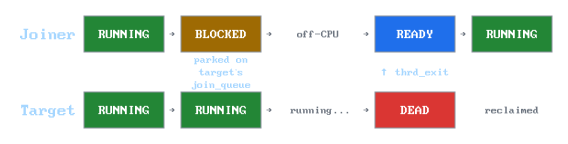
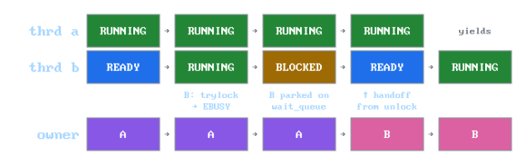

<div align="center">
  <picture>
    <source media="(prefers-color-scheme: dark)" srcset="docs/assets/header_dark.svg">
    <source media="(prefers-color-scheme: light)" srcset="docs/assets/header_light.svg">
    
  </picture>

  <p><em>An educational green threads library written in C.</em></p>

</div>

## Table of Contents

- [Introduction](#introduction)
  - [But what exactly are threads?](#but-what-exactly-are-threads)
- [Quick start](#quick-start)
  - [Hello, Thread!](#hello-thread)
- [Public interface](#public-interface)
  - [Return codes](#return-codes)
  - [Threads](#threads)
  - [Mutexes](#mutexes)
  - [Condition variables](#condition-variables)
- [Implementation](#implementation)
  - [Build setup](#build-setup)
  - [Context switching](#context-switching)
  - [Cooperative scheduling](#cooperative-scheduling)
  - [Thread lifecycle](#thread-lifecycle)
  - [Blocking primitives](#blocking-primitives)
  - [Sleep and the heap](#sleep-and-the-heap)
  - [Preemption](#preemption)
  - [Porting](#porting)
- [Roadmap](#roadmap)
- [Sources](#sources)

## Introduction

Sometimes, as a programmer, you might encounter a situation, where you need to run two or more functions side by side.
Think of a music player that needs to stream audio while updating its UI at the same time, or a web server handling multiple requests at once.
This is where **threads** come in.

### But what exactly are threads?

A **thread** is a piece of code that can be temporarily paused while running, allowing other threads to execute in its place, and then resumed at any future point in time. 
Without threads, a program can run **only one** thing at a time, start to finish, in order. 
With threads, **multiple** tasks can make progress without waiting for each other to complete.

## Quick start

Since the premise of the repository is a hands-on experience, you'll probably write and test a bunch of code in the process.

If you want to experiment with the complete, finished library before building it yourself in the tutorial, you can compile it like this:
```bash
mkdir build && cd build
cmake ..

# build the static library (.a)
cmake --build . --config Release
```
Once built, you can link the resulting static library against your own test code.
```bash
gcc my_code.c build/libthrd_ndl.a -Iinclude -o my_code
```

### Hello, Thread!

Below is a basic example on how to use the library.
```c
#include <thrd_ndl/thrd_ndl.h>
#include <stdio.h>

void thrd_a_func(void) {
  for (int i = 0; i < 3; ++i) {
    printf("Hello, Thread A! (%d)\n", i);
    thrd_yield();
  }
}

void thrd_b_func(void) {
  for (int i = 0; i < 3; ++i) {
    printf("Hello, Thread B! (%d)\n", i);
    thrd_yield();
  }
}

int main(void) {
  if (thrd_init() != THRD_SUCCESS)
    return 1;

  thrd_t thrd_a, thrd_b;

  if (thrd_create(&thrd_a, thrd_a_func) != THRD_SUCCESS)
    return 1;
  if (thrd_create(&thrd_b, thrd_b_func) != THRD_SUCCESS)
    return 1;

  thrd_join(thrd_a);
  thrd_join(thrd_b);
}
```
The expected output (for cooperative scheduling) is:
```
Hello, Thread A! (0)
Hello, Thread B! (0)
Hello, Thread A! (1)
Hello, Thread B! (1)
Hello, Thread A! (2)
Hello, Thread B! (2)
```
The code is pretty straight-forward. The two functions that are worthy of a description are:
* `thrd_yield` - voluntarily gives up the thread's turn, letting the next thread run,
* `thrd_join` - blocks the current thread until the passed thread finishes. Notably main has its own, implicitly created thread!

## Public interface

Contrary to other non-educational libraries, this section is here for a different reason.
It's an overview of functions implemented later in the [Implementation](#implementation) section.
While reading the said implementation section, you might return quite often to this section.

### Return codes

Functions that return `int` use these codes:

* `THRD_SUCCESS` - operation completed successfully (always `0`).
* `THRD_ENOMEM`  - out of capacity (pool exhausted, heap full, OS alloc fail).
* `THRD_EINVAL`  - invalid argument (`NULL` ptr, zero size, etc.).
* `THRD_EBUSY`   - resource is held by another thread.
* `THRD_EUNINIT` - passed argument is storing an uninitialized struct.

### Threads

* `int thrd_init` - must be called once before anything else. Sets up the scheduler and creates the implicit main thread. Returns `THRD_SUCCESS` on success, `THRD_EINVAL` if called more than once, or `THRD_ENOMEM` if the underlying OS allocation fails.
* `int thrd_create(thrd_t* out_thread, void (*func)(void))` - creates a new thread. Returns `THRD_SUCCESS` or `THRD_ENOMEM` if the pool is exhausted.
* `void thrd_yield` - voluntarily hands control to the next ready thread.
* `void thrd_sleep(uint64_t time_ms)` - suspends the current thread for at least `time_ms` milliseconds.
* `int thrd_join(thrd_t thrd)` - blocks until `thrd` finishes. Returns `THRD_SUCCESS` on success or if passed argument is already dead, `THRD_EINVAL` if passed argument is `NULL` or the current running thread.
* `void thrd_exit` - explicitly exits the current thread. It's called implicitly when the thread function returns.
* `void thrd_dump` - writes a snapshot of the scheduler state to `stderr`, intended as a debugging procedure, safe to call from any thread.

### Mutexes

* `int mutex_init(mutex_t* mutex)` - initializes the mutex, must be called before first use. Returns `THRD_EINVAL` if `mutex == NULL`, `THRD_SUCCESS` otherwise.
* `int mutex_lock(mutex_t* mutex)` - acquires the `mutex`, blocking the caller if already held. Returns `THRD_EINVAL` if `mutex == NULL`, `THRD_SUCCESS` otherwise.
* `int mutex_trylock(mutex_t* mutex)` - attempts to acquire `mutex` without blocking. Returns `THRD_SUCCESS` if acquired, `THRD_EBUSY` if already held.
* `int mutex_unlock(mutex_t* mutex)` - releases the `mutex` and wakes one waiting thread.  Returns `THRD_SUCCESS` if successfuly unlocked, returns `THRD_EINVAL` if the caller isn't the owner or `mutex` is `NULL`.

### Condition variables

* `int cond_init(cond_t* cond)` - initializes the cond, must be called before first use. Returns `THRD_EINVAL` if `cond == NULL`, `THRD_SUCCESS` otherwise.
* `int cond_wait(cond_t* cond, mutex_t* mutex)` - releases `mutex` and blocks, reacquires on wake. Returns `THRD_SUCCESS` was successfully awaited. Returns `THRD_EINVAL` if `cond` or `mutex` is `NULL`, or if the caller isn't the owner of `mutex`.
* `int cond_signal(cond_t* cond)` - wakes one thread waiting on the `cond` condition. Returns `THRD_EINVAL` if `cond == NULL`, `THRD_SUCCESS` otherwise.
* `int cond_bcast(cond_t* cond)` - wakes all threads waiting on the `cond` condition. Returns `THRD_EINVAL` if `cond == NULL`, `THRD_SUCCESS` otherwise.

## Implementation

This section will serve as a tutorial, split into *sections*, each adding a certain functionality to your threading library.
Each section produces a working library that can be compiled and tested. 
Feel free to experiment after finishing each section.

Up until the last section, [Preemption](#preemption), the library is purely cooperative, meaning that a single thread can run indefinitely, unless explicitly told to stop by calling `thrd_yield`.
This tutorial focuses solely on implementing *M:1* model threading.
That means the whole process of this library runs on one OS thread, creating virtual threads.

The tutorial expects a prior knowledge of the *C* language, as well as a deeper understanding of how the stack works.
An ability to read *assembly* is also recommended. 
The final code can be found in the [src/](src/) directory.
Each section has its source code in the corresponding `layerX` directory.

This entire section will use `x86_64` as the primary example, with the `ARM64` covered at the end.
Similarly, it targets Linux/macOS, the (limited) Windows port is covered at the end, both in the [Porting](#porting) section.

### Blocking primitives

In the previous demo, we still had the ugly `while (completed < 2) thrd_yield();` line.
Any kind of "wait until X" operation written with `thrd_yield` wastes turns.
With N waiters, the ready queue is N threads doing nothing.
This section will fix this.

Up to now there were three states: `THRD_READY`, `THRD_RUNNING` and `THRD_DEAD`.
Now we'll add a fourth one - for a thread, that's neither runnable nor finished - it's parked, waiting for an external event.
It will be `THRD_BLOCKED`, along with a corresponding wait queue.

Just update the enum in `src/tcb.h`:

```c
typedef enum {
  THRD_READY,
  THRD_RUNNING,
  THRD_DEAD,
  THRD_BLOCKED,
} thrd_state_t;
```

Every primitive in this section will follow the same three-step recipe:
1. Mark thread as blocked.
2. Push it onto the primitive's private wait queue.
3. Call `thrd_yield`.

Waking a thread up will be a mirrored operation.

#### `thrd_join`

`thrd_join` is the simplest primitive included in this section.
It will be responsible for blocking the caller until a target thread finishes, and it will achieve that without spinning.

Waking up joined threads will occur in `thrd_exit`, which only knows about `curr_thrd`.
That means that we need to store reference to the joining threads inside the TCB struct itself.

While [`pthread_join`](https://man7.org/linux/man-pages/man3/pthread_join.3.html) allows for a single joiner for each thread, here we'll implement a slightly more complex list of joiners per thread.
It will allow multiple threads to join the same target, waiting until it finishes.

So we need to store a head and a tail of the join queue in the TCB.
Update the struct in `src/tcb.h`:

```c
typedef struct tcb {
  void*        rsp;           // the stack pointer
  struct tcb*  next;          // intrusive next link for queue threading
  thrd_state_t state;         // current scheduler state
  void*        bsp;           // base stack pointer
  struct tcb*  join_queue_hd; // head of joiners waiting on this thread
  struct tcb*  join_queue_tl; // tail of joiners waiting on this thread
} tcb_t;
```

The join queue fields will be `NULL` until someone joins.
They will be cleared by `thrd_exit` after waking.

With the addition of a new queue, it's a good moment to generalize the `rdy_enqueue`/`rdy_dequeue` helpers to work for any queue.
Place them in a new file, `src/queue.h`:

```c
#pragma once

#include "tcb.h"    // include this for 'tcb_t'
#include <stdlib.h> // include this for 'NULL'

static inline void thrd_enqueue(tcb_t* thrd, tcb_t** hd, tcb_t** tl) {
  thrd->next = NULL;

  if (*tl != NULL)
    (*tl)->next = thrd;
  else
    *hd = thrd;

  *tl = thrd;
}

static inline tcb_t* thrd_dequeue(tcb_t** hd, tcb_t** tl) {
  if (*hd == NULL)
    return NULL;

  tcb_t* pop_thrd = *hd;
  
  *hd = pop_thrd->next;
  if (*hd == NULL)
    *tl = NULL;

  return pop_thrd;
}
```

With this added, you can remove `rdy_enqueue`/`rdy_dequeue` and replace calls to it with their generic `thrd` counterparts.

`thrd_join`, as mentioned in the introduction to this section, will simply mark the current thread as blocked, push it onto the wait queue and call `thrd_yield`.

First, add it to the public API in `include/thrd_ndl/thrd_ndl.h`:

```c
int thrd_join(thrd_t thrd);
```

Then add its implementation in `src/scheduler.c`:

```c
#include "queue.h" // include for 'thrd_enqueue'

int thrd_join(thrd_t thrd) {
  if (thrd == NULL || (tcb_t*)thrd == curr_thrd)
    return THRD_EINVAL;

  tcb_t* cast_thrd = (tcb_t*)thrd;
  if (cast_thrd->state == THRD_DEAD)
    return THRD_SUCCESS;

  curr_thrd->state = THRD_BLOCKED;

  thrd_enqueue(curr_thrd, &cast_thrd->join_queue_hd, &cast_thrd->join_queue_tl);

  thrd_yield();

  return THRD_SUCCESS;
}
```

Reading `cast_thrd->state` here is only safe while the caller knows the target's TCB hasn't been reclaimed.
It means that `thrd_join` must run before any other thread yields after the target exits - otherwise the dead-queue cleanup pass may have already returned the slot to the pool, possibly with a different thread occupying it.

Now, we need to modify `thrd_exit` to wake up every thread from `curr_thrd`'s wait queue.
It's important to wake them up **before** the yield, otherwise the dying thread yields away and the joiners sit blocked until something else happens to schedule (which it won't because nothing else will).

```c
noreturn void thrd_exit(void) {
  curr_thrd->state = THRD_DEAD;

  curr_thrd->next = dead_queue_hd;
  dead_queue_hd = curr_thrd;

  tcb_t* awake_thrd = curr_thrd->join_queue_hd;
  while (awake_thrd != NULL) {
    tcb_t* next_thrd = awake_thrd->next;

    awake_thrd->state = THRD_READY;
    thrd_enqueue(awake_thrd, &rdy_queue_hd, &rdy_queue_tl);

    awake_thrd = next_thrd;
  }

  curr_thrd->join_queue_hd = NULL;
  curr_thrd->join_queue_tl = NULL;

  thrd_yield();

  abort(); 
}
```

Putting both halves together, here's what the joiner experiences:
1. The joiner calls `thrd_join(target)`.
2. The joiner sets its own state to `THRD_BLOCKED` and enqueues itself onto `target->join_queue_hd/tl`.
3. The joiner calls `thrd_yield`. The `if (state == THRD_RUNNING)` guard skips the ready re-enqueue.
4. The scheduler dequeues some other ready thread, `thrd_switch` saves joiner's callee-saved registers onto its stack and its `%rsp` into the TCB. Joiner is frozen mid-yield.
5. (some other work happens, possibly across many yields)
6. The target eventually falls off the end of its entry function, lands in `thrd_exit`. The wake loop walks the join queue, sets each waiter to `THRD_READY`, and ready-enqueues them.
7. The scheduler later picks joiner from the ready queue. `thrd_switch` restores its saved registers, and `ret` resumes inside `thrd_yield` right after the `thrd_switch` call.
8. The joiner's `thrd_yield` returns into `thrd_join`, which then returns `THRD_SUCCESS` to its caller.

If the joiner is the only candidate the scheduler has and nothing else is ready, `thrd_yield` will hit the `_Exit(1)` branch from [Cleaning up dead threads](#cleaning-up-dead-threads) - that branch doubles as deadlock detection.

<div align="center">
  <picture>
      <source media="(prefers-color-scheme: dark)"
    srcset="docs/assets/joiner_timeline_dark.svg">
      <source media="(prefers-color-scheme: light)"
    srcset="docs/assets/joiner_timeline_light.svg">
      
  </picture>

  <p><em>State transitions during a <code>thrd_join</code>. The joiner parks on the target's join queue and stays off-CPU until the target's <code>thrd_exit</code> flips it back to <code>THRD_READY</code>.</em></p>
</div>

Unlike a `thrd_yield`, which re-queues the caller and is guaranteed to resume on its own, a blocked thread can only resume when another thread explicitly wakes it.
This is what makes the primitive "blocking" instead of "polling".

#### Zombie

In the previous subsection, we implemented `thrd_join` and noted that it is only safe if the caller knows the target thread hasn't been reclaimed yet.
If we think closely about the timeline of our thread lifecycle, there is a race condition.

Consider this sequence of events:
1. Thread `A` finishes its execution and falls into `thrd_exit`.
2. `A` pushes itself onto the dead queue and calls `thrd_yield`.
3. The scheduler picks up thread `B`. At the top of `thrd_yield`, the cleanup loop completely frees `A`'s TCB and stack to the pool.
4. Thread `C`, which was busy doing other work, finally calls `thrd_join(thrd_a)`.

`C` is now reading a dangling pointer.
Even worse, if the pool already reused that memory for a brand new thread, `C` will park itself on a completely unrelated thread's wait queue.

To fix this, we'll borrow a concept from OS kernels (like [Linux](https://access.redhat.com/sites/default/files/attachments/processstates_20120831.pdf)): a `THRD_ZOMBIE` state.
When a thread finishes executing, it doesn't immediately go to the dead queue.
Instead, it becomes a zombie, meaning that it's off the CPU but its struct and stack are still there.
It's a temporary state between e.g. `THRD_RUNNING` and `THRD_DEAD`.
It only truly dies and gets cleaned up when another thread acknowledges its death by joining it.

First, let's update `thrd_state_t` in `src/tcb.h`:

```c
typedef enum {
  THRD_READY,
  THRD_RUNNING,
  THRD_DEAD,
  THRD_BLOCKED,
  THRD_ZOMBIE,
} thrd_state_t;
```

Now we will rewrite `thrd_exit` in `src/scheduler.c`.
The logic branches based on whether anyone is already waiting for us.
If there are threads in our join queue, we wake them up and proceed to the dead queue normally (the joiner has already acknowledged us).
If there are no joiners, we become a zombie and wait for one.

```c
noreturn void thrd_exit(void) {
  if (curr_thrd->join_queue_hd != NULL) {
    // we have joiners, wake them up and proceed to the dead queue
    curr_thrd->state = THRD_DEAD;

    curr_thrd->next = dead_queue_hd;
    dead_queue_hd = curr_thrd;

    tcb_t* awake_thrd = curr_thrd->join_queue_hd;
    while (awake_thrd != NULL) {
      tcb_t* next_thrd = awake_thrd->next;

      awake_thrd->state = THRD_READY;
      thrd_enqueue(awake_thrd, &rdy_queue_hd, &rdy_queue_tl);

      awake_thrd = next_thrd;
    }

    curr_thrd->join_queue_hd = NULL;
    curr_thrd->join_queue_tl = NULL;
  } else
    // no one is waiting, become a zombie
    curr_thrd->state = THRD_ZOMBIE;

  thrd_yield();

  abort(); 
}
```

Finally, we update `thrd_join`.
If a thread calls `thrd_join` and sees the target is already a `THRD_ZOMBIE`, it means the target finished before we could park on its wait queue.
The joiner simply pushes the zombie onto the dead queue to be cleaned up, and returns immediately without yielding.

Replace the `THRD_DEAD` check in `thrd_join` with this new zombie logic:

```c
int thrd_join(thrd_t thrd) {
  if (thrd == NULL || (tcb_t*)thrd == curr_thrd)
    return THRD_EINVAL;

  tcb_t* cast_thrd = (tcb_t*)thrd;
  
  // if the target is a zombie, bury it and return immediately
  if (cast_thrd->state == THRD_ZOMBIE) {
    cast_thrd->state = THRD_DEAD;

    cast_thrd->next = dead_queue_hd;
    dead_queue_hd = cast_thrd;

    return THRD_SUCCESS;
  }

  curr_thrd->state = THRD_BLOCKED;

  thrd_enqueue(curr_thrd, &cast_thrd->join_queue_hd, &cast_thrd->join_queue_tl);

  thrd_yield();

  return THRD_SUCCESS;
}
```

But what happens if a thread exits but it's never joined?
Under this implementation, it stays a `THRD_ZOMBIE` forever, leaking its TCB and stack memory until the process terminates.
A solution to this would be to introduce a `thrd_detach` function to tell the scheduler that a thread will never be joined, allowing it to bypass the zombie state and clean itself up immediately.
This is out of scope for this implementation (for the time being).

#### Mutexes

Up to now, when threads shared state (like the `completed` counter from the [A lifecycle-aware demo](#a-lifecycle-aware-demo) section) we got away with it, but only because the read-modify-write had no yield between its halves.
Once a yield can land there, the writes race.

Consider this simple snippet:

```c
#include <thrd_ndl/thrd_ndl.h>
#include <stdio.h>

static int counter = 0;

static void func_thrd(void) {
  int local_counter = counter;

  thrd_yield();

  counter = local_counter + 1;
}

int main(void) {
  if (thrd_init() != THRD_SUCCESS)
    return 1;

  thrd_t thrd_a, thrd_b;

  if (thrd_create(&thrd_a, func_thrd) != THRD_SUCCESS)
    return 1;
  if (thrd_create(&thrd_b, func_thrd) != THRD_SUCCESS)
    return 1;

  thrd_join(thrd_a);
  thrd_join(thrd_b);

  printf("%d\n", counter);
}
```

You may think that the output will be plain `2`.
Well, you'd be wrong.
Due to a race condition, this will output `1`.

Here's the exact mechanism that occurred:
1. Thread A reads `counter = 0` into its local, it yields.
2. Thread B reads `counter = 0` into its local, it also yields.
3. A resumes after `thrd_yield`, writes `counter = 1`.
4. B resumes after `thrd_yield`, also writes `counter = 1`.

The `thrd_yield` here is explicit only to make the race reproducible.
In real code, any procedure call that internally yields can land between the read and the write - and once [Preemption](#preemption) is finished, even individual instructions can be interrupted.
The mutex closes that window regardless of where the yield actually happens.

This is also a great example that cooperative scheduling doesn't eliminate races, it just narrows where they can happen.

A mutex (**MUT**ual **EX**clusion device) serializes access to shared state.
Only one thread can hold it at a time, and any other thread that tries to acquire it blocks until the holder releases.

Unlike threads, mutexes own no OS resources - they're just an owner pointer and a wait queue.
The caller allocates them wherever the data they protect lives, the wait queue lives on the primitive itself rather than on any TCB, and the API has `mutex_init` but no `mutex_destroy`, since there's nothing internal to destroy.
The trade-off is that the caller must keep the mutex alive while any thread might be parked on it, similar to the lifetime contract from `thrd_join`.
This matches POSIX [`pthread_mutex_t`](https://man7.org/linux/man-pages/man3/pthread_mutex_lock.3.html).

As always, begin with the declaration - this time in the public API header, `include/thrd_ndl/thrd_ndl.h`:

```c
typedef struct {
  thrd_t owner;         // 'NULL' when no owner, otherwise the holding thread
  thrd_t wait_queue_hd; // head of threads parked on this mutex
  thrd_t wait_queue_tl; // tail of threads parked on this mutex
} mutex_t;
```

The mutex struct lives in the public header so callers can allocate it, but its fields reference the opaque `thrd_t`, since callers never read or write these directly.

Now we'll walk over every mutex-related procedure that will be exposed in the public API.
We'll begin with the most trivial one: `mutex_init`.

Its mission will be to zero the owner, zero the queue heads, and validate non-`NULL`.
Notice, that it essentially does the same thing as `mutex_t m = {0};` would do.
This function is mainly here for the symmetry with upcoming [Condition variables](#condition-variables).

Begin with declaring it in the public header, `include/thrd_ndl/thrd_ndl.h`

```c
int mutex_init(mutex_t* mutex);
```

Create a new file, which will contain all of the implementations for this subsection, `src/mutex.c`.
Add it to `CMakeLists.txt`.

```c
#include <thrd_ndl/thrd_ndl.h>
#include <string.h>

int mutex_init(mutex_t* mutex) {
  if (mutex == NULL)
    return THRD_EINVAL;

  memset(mutex, 0, sizeof(*mutex));

  return THRD_SUCCESS;
}
```

Next on our list is `mutex_trylock`.
We'll cover `mutex_trylock` before `mutex_lock`, because `mutex_lock` will be a wrapper over `mutex_trylock`.

Declare it in the public header:

```c
int mutex_trylock(mutex_t* mutex);
```

We want `mutex_trylock` to lock a mutex if it's possible. Otherwise we'll return a new code - we'll call it `THRD_EBUSY`:

```c
#define THRD_EBUSY 4
```

`mutex_trylock` observes the owner and either claims it for `curr_thrd` or reports busy.
However `curr_thrd` is a static variable inside `src/scheduler.c`, and we want to access it here.
We need to expose a getter to it.
Create a file `src/scheduler.h` and place this in it:

```c
#pragma once

#include "tcb.h"

tcb_t* get_curr_thrd(void);
```

Update `src/scheduler.c` with this simple function:

```c
// ...

tcb_t* get_curr_thrd(void) {
  return curr_thrd;
}
```

Finally, we can implement `mutex_trylock` in `src/mutex.c`:

```c
#include "scheduler.h" // include for 'get_curr_thrd'

int mutex_trylock(mutex_t* mutex) {
  if (mutex->owner == NULL) {
    mutex->owner = get_curr_thrd();
    return THRD_SUCCESS;
  }

  return THRD_EBUSY;
}
```

The check->set is atomic because the scheduler is cooperative.
There's no `thrd_yield` running between the read of `mutex->owner` and the write to it, so no other thread can observe the in-between state.
This is a correctness benefit we get for free from the M:1 model, and one we'll have to pay back explicitly in the [Preemption](#preemption) section by disabling preemption around critical sections like this one.

With `mutex_trylock` implemented, we can handle its older brother now - `mutex_lock`.
Thanks to `mutex_trylock`, this implementation will be simple:
1. Try locking via `mutex_trylock`, if succeeded - return.
2. Otherwise mark the `curr_thrd->state` as `THRD_BLOCKED`, enqueue on mutex's wait queue, yield.
3. On wake, don't recall `mutex_trylock`, since `mutex_unlock` set us as owner before waking us. Unlock transfers ownership directly to a waiting thread rather than clearing the field and letting the wakee re-race. This lets `mutex_lock` skip the retry.

As always, update the public header:

```c
int mutex_lock(mutex_t* mutex);
```

And the implementation in `src/mutex.c`:

```c
#include "queue.h" // include for 'thrd_enqueue'

int mutex_lock(mutex_t* mutex) {
  if (mutex == NULL)
    return THRD_EINVAL;

  if (mutex_trylock(mutex) == THRD_SUCCESS)
    return THRD_SUCCESS;

  tcb_t* curr_thrd = get_curr_thrd();
  curr_thrd->state = THRD_BLOCKED;

  thrd_enqueue(curr_thrd, (tcb_t**)&mutex->wait_queue_hd, (tcb_t**)&mutex->wait_queue_tl);

  thrd_yield();
  
  return THRD_SUCCESS;
}
```

We'll finish this section with `mutex_unlock`.
Its responsibility is to:
1. Validate the passed mutex,
2. If wait queue is empty, then clear the owner and return,
3. If wait queue is not empty, then dequeue head, set head as the new owner, flip its state to `THRD_READY` and enqueue it onto the ready queue.

Similarly to the `curr_thrd`, the ready queue is stored as a static variable inside `src/scheduler.c`.
That's why we need to expose a helper inside the scheduler - it will be responsible for resuming a thread.
We'll bring back the internal `src/scheduler.h`, which was deleted back in [`thrd_create`](#thrd_create). `cond_wait` in the next subsection will reuse it.
Add this to the scheduler's header, `src/scheduler.h`:

```c
void resume_thrd(tcb_t* thrd);
```

Implement it in `src/scheduler.c` as so:

```c
void resume_thrd(tcb_t* thrd) {
  if (thrd == NULL)
    return;

  thrd->state = THRD_READY;
  thrd_enqueue(thrd, &rdy_queue_hd, &rdy_queue_tl);
}
```

Now, going back to the `mutex_unlock` implementation, update the public header:

```c
int mutex_unlock(mutex_t* mutex);
```

And cover the implementation in `src/mutex.c`:

```c
#include "tcb.h" // include for 'tcb_t', 'THRD_READY'

int mutex_unlock(mutex_t* mutex) {
  if (mutex == NULL || mutex->owner != get_curr_thrd())
    return THRD_EINVAL;

  if (mutex->wait_queue_hd == NULL) {
    mutex->owner = NULL;
    return THRD_SUCCESS;
  }

  tcb_t* pop_thrd = thrd_dequeue((tcb_t**)&mutex->wait_queue_hd, (tcb_t**)&mutex->wait_queue_tl);
  mutex->owner = pop_thrd;
  resume_thrd(pop_thrd);

  return THRD_SUCCESS;
}
```

With the public API for mutexes handled, notice the unlocker doesn't clear the owner field when there's a waiter, it transfers ownership directly.
The alternative would be to wake one waiter up, and let it call `mutex_trylock` itself when it runs.
However, this leaves a window where a thread calling `mutex_lock` after the unlock (but before the waiter runs) could steal the mutex.
The handoff approach guarantees FIFO fairness.

Before walking through a contention scenario, a few edge cases worth knowing about:
* Recursive lock by the same thread. It's currently undefined, the second `mutex_lock` calls `mutex_trylock`, sees a non-`NULL` owner, and blocks on a wait queue no one will empty. If no other thread is ready, the `_Exit(1)` branch from the [`Cleaning up dead threads`](#cleaning-up-dead-threads) subsection doubles as a deadlock detection. This library doesn't support this kind of locking, but POSIX exposes it via [`PTHREAD_MUTEX_RECURSIVE`](https://pubs.opengroup.org/onlinepubs/7908799/xsh/pthread_mutexattr_settype.html).
* Unlock from a non-owner returns `THRD_EINVAL` via the `mutex->owner != get_curr_thrd()` check. Without this check a non-holder could transfer ownership to a waiter, breaking the mutual exclusion.
* Unlock of an unheld mutex returns `THRD_EINVAL` also via the `mutex->owner != get_curr_thrd()` check.
* Freeing a mutex while threads are parked on it wait queue corrupts their state when `mutex_unlock` later wakes them, similarly to the `thrd_join` reclaim hazard, the caller must keep the mutex alive until no waiter can reference to it.
* Don't call `memcpy` on `mutex_t`. It will get corrupted on the next enequeue, each mutex needs its own `mutex_init`.

The woken waiter doesn't return immediately, it's just queued.
The unlocker keeps running until it yields.
From the waiter's perspective it was parked in `mutex_lock`'s yield call, and when the scheduler eventually picks it up, the yield returns and `mutex_lock` returns `THRD_SUCCESS`.
The wake mechanism is identical to `thrd_join`'s, what's different is that the wake also carries ownership state with it.

Putting the four operations together, here's what a typical contention sequence looks like.
Assume `A` and `B` are both ready, `mutex` is freshly initialized.
1. `A` calls `mutex_lock(&mutex)`. `mutex_trylock(&mutex)` sees `mutex->owner == NULL`, sets `mutex->owner = A`, returns `THRD_SUCCESS`. `mutex_lock` returns immediately, without blocking or yielding.
2. `A` runs its critical section and yields.
3. `B` is picked up by the scheduler and calls `mutex_lock(&mutex)`. `mutex_trylock(&mutex)` sees `mutex->owner == A`, returns `THRD_EBUSY`.
4. `B` sets its state to `THRD_BLOCKED`, enqueues itself on `mutex`'s wait queue and calls `thrd_yield`. The `if (state == THRD_RUNNING)` guard skips the ready re-enqueue.
5. Scheduler resumes `A`. `B` meanwhile is frozen mid-yield, exactly as the joiner was in `thrd_join`.
6. `A` finishes its critical section and calls `mutex_unlock(&mutex)`. `B` is dequeues from the wait queue, set as the new mutex owner, flipped to `THRD_READY` and enqueued on the ready queue.
7. `A` keeps running, eventually yields.
8. Scheduler picks `B` from the ready queue. `thrd_switch` resumes `B` inside the `thrd_yield` from step 4, yield returns into `mutex_lock`, which returns. `B` is now the owner, and never had to retry the lock.

Two things change compared to `thrd_join`.
First, the wait queue lives on the primitive (the mutex struct), not on a TCB, so that any number of mutexes can exist independently, and a thread can park on whichever one it tries to acquire.
Second, the wake doesn't just unpark the waiter.
It also transfers ownership along with the wake, so the woken thread doesn't have to retry `mutex_trylock`.
This is what avoided the constant wake-storm mentioned earlier.
The next subsection, [Condition variables](#condition-variables), keeps the first property and drops the second.
Condition variable wakes carry no ownership, which is why they need a paired mutex to fill the gap.

<div align="center">
  <picture>
      <source media="(prefers-color-scheme: dark)"
    srcset="docs/assets/mutex_dark.svg">
      <source media="(prefers-color-scheme: light)"
    srcset="docs/assets/mutex_light.svg">
      
  </picture>

  <p><em>Ownership during a contended <code>mutex_lock</code>/<code>mutex_unlock</code> cycle. The owner field passes directly from <code>A</code> to <code>B</code> at the unlock moment, it's never <code>NULL</code> which is what prevents a third thread from barging in and stealing the mutex between unlock and <code>B</code>'s resume.</em></p>
</div>

#### Condition variables

Mutexes solve the problem of simultaneous access to shared state, but they don't solve the problem of waiting for the state to change.

Consider this scenario: thread `A` wants to pop an item from a shared queue. 
It locks the mutex, sees the queue is empty, and unlocks it.
What could it do next?
It could yield and check again later, but that's wasting CPU cycles on the ready queue just to check an empty list.

We want the thread to instead park itself entirely until another thread pushes an item onto the shared queue.
This is what the **condition variable** is responsible for.
It provides a wait queue where threads can sleep until another thread explicitly signals that a specific condition might now be true.

First, let's add the struct and function declarations to the public header, `include/thrd_ndl/thrd_ndl.h`:

```c
typedef struct {
  thrd_t wait_queue_hd; // head of threads parked on this condition
  thrd_t wait_queue_tl; // tail of threads parked on this condition
} cond_t;

int cond_init(cond_t* cond);
int cond_wait(cond_t* cond, mutex_t* mutex);
int cond_signal(cond_t* cond);
int cond_bcast(cond_t* cond);
```

We'll place the implementation in a new file, `src/cond.c`.
Don't forget to add it to `CMakeLists.txt`.
Just like `mutex_init`, `cond_init` is a simple zero-initializer.

```c
#include <thrd_ndl/thrd_ndl.h>
#include <string.h>

int cond_init(cond_t* cond) {
  if (cond == NULL)
    return THRD_EINVAL;

  memset(cond, 0, sizeof(*cond));

  return THRD_SUCCESS;
}
```

Now for the heart of the mechanism, `cond_wait`.

A thread must always hold the associated mutex before calling `cond_wait`.
Inside the function, the thread does a very specific sequence of actions:
1. Enqueues itself on the condition variable's wait queue.
2. Releases the mutex (so other threads can change the shared state).
3. Yields.
4. Upon waking up, it must reacquire the mutex before returning to the caller.

Here's the implementation in `src/cond.c`:

```c
#include "scheduler.h" // include for 'get_curr_thrd', 'resume_thrd'
#include "queue.h"     // include for 'thrd_enqueue', 'thrd_dequeue'

int cond_wait(cond_t* cond, mutex_t* mutex) {
  if (cond == NULL || mutex == NULL || mutex->owner != get_curr_thrd())
    return THRD_EINVAL;

  tcb_t* curr_thrd = get_curr_thrd();

  thrd_enqueue(curr_thrd, (tcb_t**)&cond->block_queue_hd, (tcb_t**)&cond->block_queue_tl);

  curr_thrd->state = THRD_BLOCKED;

  // unlock mutex so other thread can grab 
  // the lock and change the shared data
  mutex_unlock(mutex);

  // park the thread
  thrd_yield();

  // lock back the mutex before returning to the caller
  mutex_lock(mutex);

  return THRD_SUCCESS;
}
```

Finally, we need a way to make these sleeping threads wake up.
`cond_signal` wakes up exactly one thread from the queue.
`cond_bcast` wakes up all of them.
Unlike `mutex_unlock`, waking a thread up from a cond variable doesn't transfer any ownership, it just moves them from the `cond_t`'s wait queue to the ready queue.

Add these to `src/cond.c`:

```c
int cond_signal(cond_t* cond) {
  if (cond == NULL)
    return THRD_EINVAL;

  if (cond->wait_queue_hd != NULL) {
    tcb_t* signal_thrd = thrd_dequeue((tcb_t**)&cond->wait_queue_hd, (tcb_t**)&cond->wait_queue_tl);
    resume_thrd(signal_thrd);
  }

  return THRD_SUCCESS;
}

int cond_bcast(cond_t* cond) {
  if (cond == NULL)
    return THRD_EINVAL;

  while (cond->wait_queue_hd != NULL) {
    tcb_t* signal_thrd = thrd_dequeue((tcb_t**)&cond->wait_queue_hd, (tcb_t**)&cond->wait_queue_tl);
    resume_thrd(signal_thrd);
  }

  return THRD_SUCCESS;
}
```

To see how these pieces interact, let's trace the exact sequence of a wakeup:
1. Thread `A` calls `cond_wait`. It drops the mutex, goes to sleep, and freezes mid-yield.
2. Thread `B` acquires the mutex, changes the shared state, and calls `cond_signal`. `resume_thrd` pulls `A` off the condition wait queue and puts it on the ready queue.
3. `B` unlocks the mutex and yields. The scheduler picks up `A`.
4. `A` resumes inside `cond_wait` and immediately calls `mutex_lock`.

The last step is the most important part.
If `B` calls `cond_signal` but hasn't yet unlocked the mutex, `A` will wake up, attempt to lock the mutex, and immediately block again, this time on the mutex's wait queue.
`cond_wait` only returns to the caller once the mutex is successfully reacquired.

It's worth noting that another thread might grab the mutex first and change the state again between `A` waking up and actually acquiring the lock.
For this reason, `cond_wait` should not be an `if` statement, rather it should be wrapped in a `while` loop that checks the condition on every wake, like so:

```c
mutex_lock(&mutex);

while (queue_hd == NULL)
  cond_wait(&cond, &mutex);

// safe to pop
mutex_unlock(&mutex);
```

With this covered, we can close out the section with a demo, as usual.

#### A blocking-aware demo

With `thrd_join`, mutexes, and condition variables implemented, we have completely eliminated the need for busy-waiting in our user code.
We can now safely synchronize threads and share state.

To showcase this, we will update `func_a` and `func_b` from the previous demos.
Instead of yielding blindly and hoping they alternate perfectly, we will enforce strict alteration using a shared `curr_turn` variable, a mutex, and a cond variable.

Notice how the `while (completed < 2) thrd_yield();` in `main` is gone, replaced by two `thrd_join` calls.

```c
#include <stdio.h>
#include <thrd_ndl/thrd_ndl.h>

static mutex_t mutex;
static cond_t  cond;

static int curr_turn = 0;

static void func_a(void) {
  for (int i = 0; i < 3; ++i) {
    mutex_lock(&mutex);

    while (curr_turn != 0)
      cond_wait(&cond, &mutex);

    printf("A: %d\n", i);
    curr_turn = 1;

    cond_signal(&cond);
    mutex_unlock(&mutex);
  }
}

static void func_b(void) {
  for (int i = 0; i < 3; ++i) {
    mutex_lock(&mutex);

    while (curr_turn != 1)
      cond_wait(&cond, &mutex);

    printf("B: %d\n", i);
    curr_turn = 0;

    cond_signal(&cond);
    mutex_unlock(&mutex);
  }
}

int main(void) {
  if (thrd_init() != THRD_SUCCESS)
    return 1;

  mutex_init(&mutex);
  cond_init(&cond);

  thrd_t thrd_a, thrd_b;
  if (thrd_create(&thrd_a, func_a) != THRD_SUCCESS)
    return 1;
  if (thrd_create(&thrd_b, func_b) != THRD_SUCCESS)
    return 1;

  thrd_join(thrd_a);
  thrd_join(thrd_b);

  printf("done\n");
}
```

Build and run exactly as before:

```bash
cmake -B build && cmake --build build && ./build/demo
```

The expected output guarantees strict alteration, regardless of how the scheduler queues the threads behind the scenes:

```
A: 0
B: 0
A: 1
B: 1
A: 2
B: 2
done
```

This demo proves that our blocking architecture is working perfectly.
When `func_b` calls `cond_wait`, it drops `mutex` and sleeps.
This allows `func_a` to acquire `mutex`, print its counter, change the turn and call `cond_signal`.
`func_a` then drops `mutex`, and `func_b` wakes up, automatically reacquiring the lock to continue the cycle.

The complete code for this section lives in [tutorial/section4/](tutorial/section4/).

### Sleep and the heap

The overall outcome of this section is to add a proper `thrd_sleep(ms)` functionality to the library.
But before we will be able to put threads to sleep, the scheduler needs a reliable way to tell time.

#### Time and the platform

If a thread wants to sleep for 100ms, we need to record the current time, add 100ms, and wake the thread once the clock passes this threshhold.

We can't use standard C functions like `time` here, nor can we use POSIX `gettimeofday`.
These account for stuff like daylight saving adjustments, user changes, and NTP background synchronization.
If the system clock adjusts backwards by an hour while a thread is sleeping, a 100ms sleep turns into a one-hour (and 100ms!) wait.

To prevent this, we must use a [monotonic clock](https://linux-audit.com/what-is/monotonic-timer/).
A monotonic clock is a specialized OS timer that only ever moves forward at a constant rate, completely detached from the calendar.

We also need a way to put the underlying OS thread to sleep.
If every single thread is sleeping, the scheduler has no work to do.
If it just busy waits, it'll consume 100% of the CPU thread.
By using an OS-level sleep, the scheduler can pause the entire process and yield the CPU back to the host system until the nearest thread is due to wake up.

Let's add two new helpers to `src/platform.h`:

```c
#include <stdint.h> // include for 'uint64_t'

// ...

uint64_t get_os_time(void);
void     os_sleep_ms(uint64_t time_ms);
```

Since we are focusing on Linux/macOS for the time being, we will use `clock_gettime` with `CLOCK_MONOTONIC` to get the time in milliseconds, and `nanosleep` to park the OS thread.
Add the following to `src/platform.c`:

```c
#include <time.h> // include for 'struct timespec', 'clock_gettime', 'CLOCK_MONOTONIC', 'nanosleep'

// ...

uint64_t get_os_time(void) {
  struct timespec ts;
  clock_gettime(CLOCK_MONOTONIC, &ts);

  return (ts.tv_sec * 1000ULL) + (ts.tv_nsec / 1000000ULL);
}

void os_sleep_ms(uint64_t time_ms) {
  struct timespec ts;
  ts.tv_sec = time_ms / 1000ULL;
  ts.tv_nsec = (time_ms - (ts.tv_sec * 1000ULL)) * 1000000ULL;

  nanosleep(&ts, NULL);
}
```

The Windows equivalent will be covered in the [Porting](#porting) section.

With our timekeeping primitives in place, we can move on to the data structure that will hold our sleeping threads, the binary min-heap.

#### The binary min-heap

When threads go to sleep, the scheduler needs a way to keep track of them and wake them up at the correct time.

A naive approach would be to push sleeping threads onto a simple linked list, just like we did with all the queues.
But how do we know which thread to wake up first? 
We would need to either search a whole list on every tick (*O(n)* time), or we could keep the list sorted so the earliest wake-up time is always at the head.
But keeping a linked list sorted means every time a thread goes to sleep, we have to walk the list to find the right insertion point (also *O(n)* time).

Instead, we will use a [binary min-heap](https://www.andrew.cmu.edu/course/15-121/lectures/Binary%20Heaps/heaps.html).
A min-heap is a tree-like data structure where every parent node has a smaller value than its children.
This guarantees that the smallest value (the earliest wake-up time) is always instantly accessible at the root (*O(1)* time).
Inserting a new thread or extracting the root takes at most *O(log n)* steps, being way better than the naive approach.

First, let's update our TCB to store its scheduled wake-up time.
Open `src/tcb.h` and add `wakeup_time`:

```c
#include <stdint.h> // include for 'uint64_t'

// ...

typedef struct tcb {
  void*        rsp;           // the stack pointer
  struct tcb*  next;          // intrusive next link for queue threading
  thrd_state_t state;         // current scheduler state
  void*        bsp;           // base stack pointer
  struct tcb*  join_queue_hd; // head of joiners waiting on this thread
  struct tcb*  join_queue_tl; // tail of joiners waiting on this thread
  uint64_t     wakeup_time;   // the abs monotonic time this thread should wake
} tcb_t;
```

Instead of hardcoding the heap directly for the scheduler, we'll build a generic, reusable heap structure (like we did with the [Pool allocator](#pool-allocator)).
It will take a backing array, a capacity, and a custom comparison function, allowing us to use it for TCBs.

Let's declare the API in a new file, `src/heap.h`:

```c
#pragma once

#include <stddef.h> // include for 'size_t'

typedef struct {
  void** data;
  size_t count;
  size_t cap;
  // comparator returns:
  // < 0 if a should return first,
  // > 0 if b should return first,
  // 0 if equal.
  int (*cmp)(const void* a, const void* b);
} heap_t;

int   heap_new(heap_t* heap, void** storage, size_t cap, int (*cmp_fn)(const void*, const void*));
int   heap_push(heap_t* heap, void* obj);
void* heap_peek(const heap_t* heap);
void* heap_pop(heap_t* heap);
```

Next, create `src/heap.c`.
Add it to your `CMakeLists.txt`.
The logic relies on treating a flat array as a binary tree.
When we push an object, we place it at the end of the array and sift it up until it is no longer smaller than its parent.
When we pop the root, we take the last element in the array, move it to the root, and sift it down until it is smaller than its children.
Place the implementation below in `src/heap.c`.

```c
#include "heap.h"
#include <assert.h>
#include <stddef.h>
#include <thrd_ndl/thrd_ndl.h>

#define PARENT(i)  (((i) - 1) / 2)
#define CHILD_L(i) (((i) * 2) + 1)
#define CHILD_R(i) (((i) * 2) + 2)

static inline void sift_up(heap_t* heap, size_t idx);
static inline void sift_down(heap_t* heap, size_t idx);

int heap_new(heap_t* heap, void** storage, size_t cap, int (*cmp_fn)(const void*, const void*)) {
  if (cap == 0 || heap == NULL || storage == NULL || cmp_fn == NULL)
    return THRD_EINVAL;

  heap->data = storage;
  heap->count = 0;
  heap->cap = cap;
  heap->cmp = cmp_fn;

  return THRD_SUCCESS;
}

int heap_push(heap_t* heap, void* obj) {
  if (heap == NULL || obj == NULL)
    return THRD_EINVAL;

  if (heap->count == heap->cap)
    return THRD_ENOMEM;

  heap->data[heap->count++] = obj;
  sift_up(heap, heap->count - 1);

  return THRD_SUCCESS;
}

void* heap_peek(const heap_t* heap) {
  if (heap == NULL || heap->count == 0)
    return NULL;

  return heap->data[0];
}

void* heap_pop(heap_t* heap) {
  if (heap == NULL || heap->count == 0)
    return NULL;

  void* pop_data = heap->data[0];
  heap->data[0] = heap->data[--heap->count];

  // this does nothing if heap->count <= 1
  sift_down(heap, 0);

  return pop_data;
}

static inline void heap_swap(heap_t* heap, size_t idx_a, size_t idx_b) {
  void* tmp = heap->data[idx_a];
  heap->data[idx_a] = heap->data[idx_b];
  heap->data[idx_b] = tmp;
}

static inline void sift_up(heap_t* heap, size_t idx) {
  while (idx > 0) {
    size_t par_idx = PARENT(idx);

    if (heap->cmp(heap->data[idx], heap->data[par_idx]) >= 0)
      break;

    heap_swap(heap, idx, par_idx);

    idx = par_idx;
  }
}

static inline void sift_down(heap_t* heap, size_t idx) {
  while (1) {
    size_t l_idx = CHILD_L(idx);
    size_t r_idx = CHILD_R(idx);
    size_t min_idx = idx;

    if (l_idx < heap->count && heap->cmp(heap->data[l_idx], heap->data[min_idx]) < 0)
      min_idx = l_idx;
    
    if (r_idx < heap->count && heap->cmp(heap->data[r_idx], heap->data[min_idx]) < 0)
      min_idx = r_idx;

    // if both indices are either out of range, or are bigger than data[idx],
    // then break
    if (min_idx == idx)
      break;

    // else swap and continue from the smallest index
    heap_swap(heap, idx, min_idx);
    idx = min_idx;
  }
}
```

We didn't use the intrusive `next` pointer approach like we did with the TCB, because using the macros defined at the top a binary heap accesses parent and child nodes at *O(1)* time, whereas an intrusive structure would require complex pointer juggling and tree-balancing algorithms to achieve the same result.

With this handled, we can instantiate it inside our scheduler and expose the `thrd_sleep` API.

<div align="center">
  <p><em>For a more in-depth explanation of how this data structure functions, check <a href="https://www.andrew.cmu.edu/course/15-121/lectures/Binary%20Heaps/heaps.html">this</a> (it was also linked above).</em></p>
</div>

#### `thrd_sleep`

With our monotonic clock and priority queue in place, we are ready to implement the `thrd_sleep` function.

We'll begin with adding a new state to the enum in `src/tcb.h`:

```c
typedef enum {
  THRD_READY,
  THRD_RUNNING,
  THRD_DEAD,
  THRD_BLOCKED,
  THRD_ZOMBIE,
  THRD_SLEEPING,
} thrd_state_t;
```

Next, expose the new sleep function in the public API header, `include/thrd_ndl/thrd_ndl.h`:

```c
#include <stdint.h> // include for 'uint64_t'

// ...

void thrd_sleep(uint64_t time_ms);
```

Now we will wire up the generic `heap_t` into the scheduler.
In `src/scheduler.c` we need an array to back the heap, the heap struct itself, and a comparison function that tells the heap how to sort `tcb_t` structs based on theier wakeup time.

Add the following to `src/scheduler.c`:

```c
#include "heap.h"     // include for 'heap_new'
#include "internal.h" // include for 'POOL_THRD_CNT'

static void* sleep_heap_storage[POOL_THRD_CNT];
static heap_t sleep_queue;
static int wakeup_cmp(const void* a, const void* b);

// ...

static int wakeup_cmp(const void* a, const void* b) {
  const uint64_t wakeup_a = ((tcb_t*)a)->wakeup_time;
  const uint64_t wakeup_b = ((tcb_t*)b)->wakeup_time;

  return (wakeup_a > wakeup_b) - (wakeup_a < wakeup_b);
}
```

We must initialize the heap when the scheduler starts.
Hence, add the initialization call to `thrd_init`:

```c
int thrd_init(void) {
  // already init check ...
  // pool init ...

  // initialize sleep binary heap
  int heap_ret_val = heap_new(&sleep_queue, sleep_heap_storage, POOL_THRD_CNT, wakeup_cmp);
  if (heap_ret_val != THRD_SUCCESS)
    return heap_ret_val;

  // create main thrd ...
}
```

Finally, we can implement `thrd_sleep`.

When a thread wants to sleep, it does the following:
1. Asks the OS for the current time.
2. Adds the requested sleep duration to calculate its absolute `wakeup_time`.
3. Changes its state to `THRD_SLEEPING`.
4. Pushes itself onto the heap.
5. Yields.

Add this implementation to `src/scheduler.c`:

```c
#include "platform.h" // include for 'get_os_time'

void thrd_sleep(uint64_t time_ms) {
  if (curr_thrd == NULL)
    return;

  if (time_ms == 0) {
    thrd_yield();
    return;
  }

  curr_thrd->wakeup_time = get_os_time() + time_ms;
  curr_thrd->state = THRD_SLEEPING;

  heap_push(&sleep_queue, curr_thrd);

  thrd_yield();
}
```

Notice that if `time_ms == 0`, then we skip the heap entirely and just call `thrd_yield`.

Because the thread changes its state to `THRD_SLEEPING`, `thrd_yield`'s guard (`if (curr_thrd->state == THRD_RUNNING)`) will skip putting it back onto the ready queue.
The thread will be suspended, sitting at the correctly sorted position in the min-heap.

But right now we have no option to wake it up.
As it stands, a sleeping thread will stay on the heap forever.
In the next subsection, we will update the scheduler loop to process this heap and actually wake threads up when their time arrives.

#### Waking up, the sleeping scheduler

A sleeping thread is completely off the CPU.
It relies entirely on whichever thread that happens to be running `thrd_yield`, to notice that its deadline has passed and move it back to the ready queue.

Every time a thread yields, we need to check the top of the sleep heap.
Because it's a min-heap, the earliest/closest wakeup time is at `heap_peek(&sleep_queue)`.
If the current time is greater than or equal to that thread's wakeup time, it is time to wake it up.
Furthermore, because multiple threads might have deadlines that passed while the CPU was busy, we must check it in a `while` loop until the root is a thread that is still sleeping.

Let's place it after the `THRD_RUNNING` check inside `thrd_yield` in `src/scheduler.c`:

```c
void thrd_yield(void) {
  // ...

  // stop the current thread from running
  if (curr_thrd->state == THRD_RUNNING) {
    curr_thrd->state = THRD_READY;
    thrd_enqueue(curr_thrd, &rdy_queue_hd, &rdy_queue_tl);
  }

  uint64_t curr_time_ms = get_os_time();
  tcb_t* sleep_hd = (tcb_t*)heap_peek(&sleep_queue);
  while (sleep_hd != NULL && curr_time_ms >= sleep_hd->wakeup_time) {
    heap_pop(&sleep_queue);

    sleep_hd->state = THRD_READY;
    thrd_enqueue(sleep_hd, &rdy_queue_hd, &rdy_queue_tl);

    sleep_hd = (tcb_t*)heap_peek(&sleep_queue);
  }

  // ...
}
```

This logic handles handles threads waking up, provided the CPU is constantly calling `thrd_yield`.
But what happens if the ready queue is completely empty, the dead queue is clean, but there are threads sitting in the sleep heap waiting for their time to come?

Currently, if the ready queue is empty, `thrd_yield` reaches the end, sees `next_thrd == NULL` and checks if we should exit:

```c
if (next_thrd == NULL && curr_thrd->state == THRD_DEAD)
  _Exit(0);
else if (next_thrd == NULL && curr_thrd->state != THRD_RUNNING)
  _Exit(1);
```

If we hit this branch while threads are sleeping, the process crashes with `_Exit(1)`, even though it's just resting.
To fix this, if the ready queue is empty, we calculate the time difference between now and the top of the sleep heap, and tell the underlying OS thread to sleep for exactly that duration.
We can structure this cleanly by wrapping the dequeue logic in a `while (rdy_queue_hd == NULL)` loop in `thrd_yield`, replacing the old `if`-statements:

```c
while (rdy_queue_hd == NULL) {
  // there's no one else waiting,
  // keep running the thread
  tcb_t* sleep_hd = (tcb_t*)heap_peek(&sleep_queue);
  if (sleep_hd != NULL) {
    // wait here until thread wakes up,
    curr_time_ms = get_os_time();

    // prevent underflow if late
    if (sleep_hd->wakeup_time > curr_time_ms)
      os_sleep_ms(sleep_hd->wakeup_time - curr_time_ms);
    
    curr_time_ms = get_os_time();
    while (sleep_hd != NULL && curr_time_ms >= sleep_hd->wakeup_time) {
      tcb_t* awake_thrd = heap_pop(&sleep_queue);
      awake_thrd->state = THRD_READY;
      thrd_enqueue(awake_thrd, &rdy_queue_hd, &rdy_queue_tl);
      sleep_hd = (tcb_t*)heap_peek(&sleep_queue);
    }

  } else if (curr_thrd->state == THRD_DEAD) // all threads are dead, close the program
    _Exit(0);
  else // all threads blocked with no holders
    _Exit(1);
}

// guaranteed to have a ready thread now
tcb_t* next_thrd = thrd_dequeue(&rdy_queue_hd, &rdy_queue_tl);
```

By parking the OS thread with `os_sleep_ms`, we keep our scheduler's CPU usage at 0% while all virtual threads are asleep.
When the OS wakes up, we immediately process the heap, move the awakened threads to the ready queue, and break out the loop to context switch to them.

#### A sleep-aware demo

With our heap and scheduler integrated, we can finally test `thrd_sleep`.

We'll update our demo so `func_a` and `func_b` sleep for different durations.
Instead of using mutexes to enforce strict alteration, we'll rely entirely on `thrd_sleep`.
`func_a` will sleep for 200ms, and `func_b` will sleep for 100ms.

Because `func_b` sleeps for half the time of `func_a`, we expect it to print twice as often.

```c
#include <stdio.h>
#include <thrd_ndl/thrd_ndl.h>

static void func_a(void) {
  for (int i = 0; i < 3; ++i) {
    printf("A: %d\n", i);
    thrd_sleep(200);
  }
}

static void func_b(void) {
  for (int i = 0; i < 6; ++i) {
    printf("B: %d\n", i);
    thrd_sleep(100);
  }
}

int main(void) {
  if (thrd_init() != THRD_SUCCESS)
    return 1;

  thrd_t thrd_a, thrd_b;
  if (thrd_create(&thrd_a, func_a) != THRD_SUCCESS)
    return 1;
  if (thrd_create(&thrd_b, func_b) != THRD_SUCCESS)
    return 1;

  thrd_join(thrd_a);
  thrd_join(thrd_b);

  printf("done\n");
}
```

Rebuild exactly as before:

```bash
cmake -B build && cmake -build build && ./build/demo
```

The expected output differs here from the last demos.
It shows the threads naturally interleaving based entirely on the monotonic clock and our min-heap.

```
A: 0
B: 0
B: 1
A: 1
B: 2
B: 3
A: 2
B: 4
B: 5
done
```

If you watch this in the terminal, it won't instantly print.
The 100ms/200ms pauses will be physically visible.
Because of the `os_sleep_ms` call placed at the bottom of `thrd_yield`, the CPU usage during those pauses will sit at 0%.

The complete code for this section lives in [tutorial/section5/](tutorial/section5/)

### Preemption

Up to now, the library has been fully cooperative.
Threads must explicitly yield control by calling `thrd_yield` (or by calling `thrd_sleep`/`mutex_lock` which yield internally).

Cooperative scheduling is highly efficient and naturally avoids many race conditions.
But if a user writes a thread with an infinite loop, or just a long task that forgets to yield, it will fry the CPU forever.
No other thread will ever run, and the whole program will hang.

To build a robust system, we need [preemption](https://en.wikipedia.org/wiki/Preemption_(computing)): the ability to forcibly interrupt a running thread, take the CPU away from it, and hand it to someone else.

#### The timer and the signal

To forcibly pause a thread, we need the OS's help. On Unix-like systems, we can ask the OS to send our process a signal at a regular interval using a timer.

We will use `ITIMER_VIRTUAL`.
It only counts down while our process is actively in user space.
When the timer hits zero, the OS fires a `SIGVTALRM` signal, pausing whatever instruction the current thread is executing to run a signal handler.

That signal handler will simply run `thrd_yield`.

Let's declare the functions in `src/platform.h`:

```c
void preempt_disable(void);
void preempt_enable(void);
void timer_init(void);
```

Now, let's implement the timer in `src/platform.c`.
We will set the timer to some arbitrary value around 10ms.
Since the `tv_usec` field expects microseconds, we need a value around 10000.
Setting it to exactly 10ms might be less reliable, since it might perfectly sync with the host OS's internal scheduler ticks.
That's why we'll use a prime number instead.

```c
#include <string.h>            // include for 'memset'
#include <thrd_ndl/thrd_ndl.h> // include for 'thrd_yield'
#include <signal.h>            // include for 'sigaction'
#include <sys/time.h>          // include for 'struct sigaction', 'struct itimerval'
#include <stdio.h>             // include for 'perror'

#define PREEMPT_TIMER_INTERVAL 7331

// ...

static void signal_handler(int num) {
  (void)num;
  thrd_yield();
}

void timer_init(void) {
  struct sigaction action;
  memset(&action, 0, sizeof(action));
  action.sa_handler = signal_handler;

  if (sigaction(SIGVTALRM, &action, NULL) == -1) {
    perror("sigaction failed");
    _Exit(1);
  }

  struct itimerval timer;
  memset(&timer, 0, sizeof(timer));
  timer.it_value.tv_usec = PREEMPT_TIMER_INTERVAL;
  timer.it_interval.tv_usec = PREEMPT_TIMER_INTERVAL;

  if (setitimer(ITIMER_VIRTUAL, &timer, NULL) == -1) {
    perror("setitimer failed");
    _Exit(1);
  }
}
```

We must call `timer_init` once inside `thrd_init`.
Call it like so:

```c
int thrd_init(void) {
  // ...

  timer_init();

  return THRD_SUCCESS;
}
```

From that moment on, every ~7ms the OS will interrupt the running thread, push a signal frame onto its stack, and jump to `signal_handler`, which yields to the next thread.

The Windows implementation will use a completely different architecture, because Windows doesn't have POSIX signals. It's covered in the [Porting](#porting) section.

#### Protecting the scheduler

However, we just introduced a massive concurrency problem.
Because `SIGVTALRM` can interrupt the thread at any machine instruction, `thrd_yield` can now be called at any time, including while the scheduler is already inside `thrd_yield` or `mutex_lock`.

Imagine a thread is inside `mutex_trylock(&mutex)`:
1. It sees `mutex->owner == NULL`.
2. The timer fires. The thread is preempted.
3. Another thread runs, calls `mutex_lock(&mutex)`, sees `mutex->owner == NULL`, and claims it.
4. The first thread resumes, executes `mutex->owner = get_curr_thrd()`, and overwrites the owner. Now two threads think they own the mutex.

To prevent this, we need to protect our internal scheduler structures by temporarily disabling the timer during critical sections.
We'll implement a recursive counter so we can safely nest these calls.
Add this to `src/platform.c`:

```c
static volatile int preempt_cnt = 0;

// ...

void preempt_disable(void) {
  if (preempt_cnt++ == 0) {
    sigset_t sigset;
    sigemptyset(&sigset);
    sigaddset(&sigset, SIGVTALRM);
    sigprocmask(SIG_BLOCK, &sigset, NULL);
  }
}

void preempt_enable(void) {
  if (--preempt_cnt == 0) {
    sigset_t sigset;
    sigemptyset(&sigset);
    sigaddset(&sigset, SIGVTALRM);
    sigprocmask(SIG_UNBLOCK, &sigset, NULL);
  }
}
```

By using `sigprocmask` to block `SIGVTALRM`, the OS will hold the signal pending until we unblock it.

Now, we must wrap every internal scheduler operation.
The most important one is `thrd_yield` itself.
A thread entering `thrd_yield` disables preemption, does the scheduling work, switches context, and then the newly resumed thread reenables preemption on its way out:

```c
void thrd_yield(void) {
  preempt_disable();

  // ...

  preempt_enable();
}
```

You must also place `preempt_disable` and `preempt_enable` around the logic in `thrd_create`, `thrd_exit`, `thrd_join`, `thrd_sleep`, `resume_thrd`, `cond_wait`, `cond_signal`, `cond_bcast`, `mutex_lock`, `mutex_trylock` and `mutex_unlock`.
For the exact positioning check the source code in [tutorial/section6/](tutorial/section6/).
Every piece of code that reads or modifies a queue or shared scheduler state is a critical section.

#### The first-run problem

By wrapping our scheduler functions in `preempt_disable` and `preempt_enable`, we protected the queues.
But we accidentally introduced a deadlock for new threads.

Look at this logic in `thrd_yield`:

```c
void thrd_yield(void) {
  preempt_disable();

  // ...

  thrd_switch(old_thrd, curr_thrd);

  preempt_enable();
}
```

When `thrd_switch` resumes an existing thread, it returns from the assembly call, hits `preempt_enable`, and execution continues normally.
But when `thrd_switch` jumps to a new thread, the assembly `ret` instruction jumps directly into the user's entry function.
The new thread completely bypasses `preempt_enable`.
The timer remains disabled, and preemption is permanently broken.

To fix this, we will use a thread wrapper.
Instead of pointing the initial stack frame at the user's function, we point it at a wrapper.

First, update the TCB in `src/tcb.h` to store the user's function pointer:

```c
typedef struct tcb {
  void*        rsp;                // the stack pointer
  struct tcb*  next;               // intrusive next link for queue threading
  thrd_state_t state;              // current scheduler state
  void*        bsp;                // base stack pointer
  struct tcb*  join_queue_hd;      // head of joiners waiting on this thread
  struct tcb*  join_queue_tl;      // tail of joiners waiting on this thread
  uint64_t     wakeup_time;        // the abs monotonic time this thread should wake
  void         (*user_proc)(void); // the actual user entry function
} tcb_t;
```

Now, create the wrapper function in `src/tcb.c`:

```c
#include "scheduler.h" // include for 'get_curr_thrd'

static void tcb_wrap(void) {
  preempt_enable();
  get_curr_thrd()->user_proc();
  thrd_exit();
}
```

Finally, update `tcb_init` in `src/tcb.c` to use this wrapper.

We still push `thrd_exit` onto the stack before `tcb_wrap`.
Even though `tcb_wrap` explicitly calls `thrd_exit`, pushing this 8-byte value simulates the return address that a normal call instruction would leave on the stack.
This ensures the stack pointer is 16-byte aligned when `tcb_wrap` begins executing.

```c
tcb_t* tcb_init(void (*entry)(void)) {
  // ...

  tcb->user_proc = entry;

  size_t size  = THRD_STACK_SIZE + page_size();
  uint64_t* sp = (uint64_t*)((uint8_t*)tcb->bsp + size);

  *(--sp) = (uint64_t)thrd_exit; // push the cleanup function (align + fail-safe)
  *(--sp) = (uint64_t)tcb_wrap;  // jump to the wrapper, not 'entry'

  sp -= CALLEE_REG_CNT; // space for callee-saved registers
  memset(sp, 0, CALLEE_REG_CNT * sizeof(void*));

  tcb->rsp   = sp;
  tcb->state = THRD_READY;
  return tcb;
}
```

It fixes the preemption bug, as well as establishes a clean, predictable lifecycle for every thread.

#### A preemptive demo

With preemption and critical sections in place, our threads act like actual OS threads.
Let's prove it by writing a notoriously bad thread that enters an infinite loop and refuses to yield.

```c
#include <stdio.h>
#include <thrd_ndl/thrd_ndl.h>

// the 'polite' thread
static void func_a(void) {
  for (int i = 0; i < 3; ++i) {
    printf("polite thread running\n");
    thrd_sleep(100);
  }
}

// the 'greedy' thread
static void func_b(void) {
  printf("starting an infinite loop\n");
  volatile int counter = 0;
  while (1) {
    counter++;
  }
}

int main(void) {
  if (thrd_init() != THRD_SUCCESS)
    return 1;

  thrd_t thrd_a, thrd_b;
  if (thrd_create(&thrd_a, func_a) != THRD_SUCCESS)
    return 1;
  if (thrd_create(&thrd_b, func_b) != THRD_SUCCESS)
    return 1;

  thrd_join(thrd_a); // only waiting for the 'polite' thread

  printf("done\n");
}
```
Build it as always:

```bash
cmake -B build && cmake --build build && ./build/demo
```

The expected output is:

```
starting an infinite loop
polite thread running
polite thread running
polite thread running
done
```

The OS timer forcefully takes away the control from the infinite loop every ~7ms, checks the sleep queue, sees that `thrd_a` isn't ready yet, and gives back the control to the greedy loop.
But once 100ms passes, `thrd_a` is woken up, scheduled, prints it message, and goes back to sleep.

The complete code for this section lives in [tutorial/section6/](tutorial/section6/)

### Porting

So far, this tutorial has focused entirely on x86_64 architecture running on Unix-like OSs (Linux/macOS).
In this section we'll make this library truly cross-platform, supporting ARM64 architecture and Windows.

#### Windows preemption

Windows support requires replacing `mmap` with `VirtualAlloc`, which is straightforward.
The real challenge is preemption.
Windows does not have POSIX signals, so there is no `SIGVTALRM`.

To solve this, we spin up a dedicated OS timer thread. 
Every ~7ms, this thread explicitly suspends the main OS thread running our scheduler.
But we can't just call `thrd_yield` from the timer thread, it has to execute on the main thread's stack.

To force the main thread to yield itself, we'll use a simple trick.
While the main thread is suspended, the timer thread modifies the main thread's CPU context to set the [trap flag](https://en.wikipedia.org/wiki/Trap_flag).
The trap flag tells the CPU to execute exactly one instruction and then trigger a hardware breakpoint ([`EXCEPTION_SINGLE_STEP`](https://learn.microsoft.com/en-us/windows/win32/api/winnt/ns-winnt-exception_record)).

We register a [vectored exception handler](https://learn.microsoft.com/en-us/windows/win32/debug/vectored-exception-handling) to catch this breakpoint.
When the handler fires, it is executing on the main thread.
It clears the trap flag and calls `thrd_yield`.

Here's the full implementation for `src/platform.c`:

```c
#include "platform.h"
#include <stdint.h>            // include for 'uint64_t'
#include <thrd_ndl/thrd_ndl.h> // include for 'thrd_yield'

#define PREEMPT_TIMER_INTERVAL 7331
static volatile int preempt_cnt = 0;

static inline size_t align_to_page(size_t size);

#ifdef _WIN32

#define NOMINMAX
#include <windows.h>
#include <memoryapi.h>

#define TRAP_FLAG_MASK 0x100ULL

static HANDLE main_thrd;
static HANDLE timer_thrd;

uint64_t get_os_time(void) {
  static LARGE_INTEGER win_freq = {0};
  if (win_freq.QuadPart == 0)
    QueryPerformanceFrequency(&win_freq);

  LARGE_INTEGER ticks;
  QueryPerformanceCounter(&ticks);

  return (ticks.QuadPart * 1000ULL) / win_freq.QuadPart;
}

void os_sleep_ms(uint64_t time_ms) {
  Sleep((DWORD)time_ms);
}

void* os_alloc(size_t size) {
  return VirtualAlloc(NULL, align_to_page(size), MEM_RESERVE | MEM_COMMIT, PAGE_READWRITE);
}

void os_free(void* ptr, size_t size) {
  (void)size;

  if (ptr == NULL) 
    return;

  VirtualFree(ptr, 0, MEM_RELEASE);
}

int protect_page(void* ptr, size_t size) {
  DWORD old_prot = 0;
  BOOL success = (int)VirtualProtect(ptr, align_to_page(size), PAGE_NOACCESS, &old_prot);
  return success ? 0 : -1;
}

size_t page_size(void) {
  static size_t cached_page_size = 0;

  if (cached_page_size == 0) {
    SYSTEM_INFO sysInfo;
    GetSystemInfo(&sysInfo);
    cached_page_size = (size_t)sysInfo.dwPageSize;
  }

  return cached_page_size;
}

LONG WINAPI signal_handler(PEXCEPTION_POINTERS except_info) {
  if (except_info->ExceptionRecord->ExceptionCode == EXCEPTION_SINGLE_STEP) {
    except_info->ContextRecord->EFlags &= ~0x100ULL;

    if (preempt_cnt == 0)
      thrd_yield();

    return EXCEPTION_CONTINUE_EXECUTION;
  }

  return EXCEPTION_CONTINUE_SEARCH;
}

DWORD WINAPI timer_loop(LPVOID arg) {
  (void)arg;
  while (1) {
    Sleep(PREEMPT_TIMER_INTERVAL / 1000); // milliseconds

    if (preempt_cnt == 0) {
      SuspendThread(main_thrd);

      if (preempt_cnt == 0) {
        CONTEXT ctx;
        ctx.ContextFlags = CONTEXT_CONTROL;
        if (GetThreadContext(main_thrd, &ctx)) {
          ctx.EFlags |= TRAP_FLAG_MASK;
          SetThreadContext(main_thrd, &ctx);
        }
      }

      ResumeThread(main_thrd);
    }
  }

  return 0;
}

void timer_init(void) {
  DuplicateHandle(GetCurrentProcess(), GetCurrentThread(),
                  GetCurrentProcess(), &main_thrd, 0,
                  FALSE, DUPLICATE_SAME_ACCESS);
                  
  AddVectoredExceptionHandler(1, signal_handler);
  timer_thrd = CreateThread(NULL, 0, timer_loop, NULL, 0, NULL);
}

void preempt_disable(void) {
  preempt_cnt++;
}

void preempt_enable(void) {
  preempt_cnt--;
}

#else

#include <sys/mman.h>
#include <unistd.h>
#include <time.h>
#include <signal.h>
#include <sys/time.h>
#include <stdio.h>
#include <string.h>

void* os_alloc(size_t size) {
  void* ptr = mmap(NULL, align_to_page(size), PROT_READ | PROT_WRITE, MAP_PRIVATE | MAP_ANON, -1, 0);
  return (ptr == MAP_FAILED) ? NULL : ptr;
}

void os_free(void* ptr, size_t size) {
  if (ptr == NULL) 
    return;

  munmap(ptr, align_to_page(size));
}

int protect_page(void* ptr, size_t size) {
  return mprotect(ptr, align_to_page(size), PROT_NONE);
}

size_t page_size(void) {
  static size_t cached_page_size = 0;
  if (cached_page_size == 0)
    cached_page_size = (size_t)sysconf(_SC_PAGESIZE);

  return cached_page_size;
}

uint64_t get_os_time(void) {
  struct timespec ts;
  clock_gettime(CLOCK_MONOTONIC, &ts);

  return (ts.tv_sec * 1000ULL) + (ts.tv_nsec / 1000000ULL);
}

void os_sleep_ms(uint64_t time_ms) {
  struct timespec ts;
  ts.tv_sec = time_ms / 1000ULL;
  ts.tv_nsec = (time_ms - (ts.tv_sec * 1000ULL)) * 1000000ULL;

  nanosleep(&ts, NULL);
}

static void signal_handler(int num) {
  (void)num;
  thrd_yield();
}

void timer_init(void) {
  struct sigaction action;
  memset(&action, 0, sizeof(action));
  action.sa_handler = signal_handler;

  if (sigaction(SIGVTALRM, &action, NULL) == -1) {
    perror("sigaction failed");
    _Exit(1);
  }

  struct itimerval timer;
  memset(&timer, 0, sizeof(timer));
  timer.it_value.tv_usec = PREEMPT_TIMER_INTERVAL;
  timer.it_interval.tv_usec = PREEMPT_TIMER_INTERVAL;

  if (setitimer(ITIMER_VIRTUAL, &timer, NULL) == -1) {
    perror("setitimer failed");
    _Exit(1);
  }
}

void preempt_disable(void) {
  if (preempt_cnt++ == 0) {
    sigset_t sigset;
    sigemptyset(&sigset);
    sigaddset(&sigset, SIGVTALRM);
    sigprocmask(SIG_BLOCK, &sigset, NULL);
  }
}

void preempt_enable(void) {
  if (--preempt_cnt == 0) {
    sigset_t sigset;
    sigemptyset(&sigset);
    sigaddset(&sigset, SIGVTALRM);
    sigprocmask(SIG_UNBLOCK, &sigset, NULL);
  }
}

#endif

void* os_alloc_stack(size_t usable_size) {
  size_t total_size = usable_size + page_size(); // page_size for guard

  void* ptr = os_alloc(total_size);
  if (ptr == NULL)
    return NULL;

  if (protect_page(ptr, page_size()) != 0) {
    os_free(ptr, total_size);
    return NULL;
  }

  return ptr;
}

void os_free_stack(void* base_ptr, size_t usable_size) {
  os_free(base_ptr, usable_size + page_size());
}

static inline size_t align_to_page(size_t size) {
  size_t p_size = page_size();
  return (size + (p_size - 1)) & ~(p_size - 1);
}
```

#### Windows ABI differences

In addition to the timer mechanism, the [Windows x86_64 ABI](https://learn.microsoft.com/en-us/cpp/build/x64-calling-convention?view=msvc-170) differs from the [System V ABI](https://refspecs.linuxbase.org/elf/x86_64-abi-0.99.pdf) in two crucial ways:
1. Instead of `%rdi` and `%rsi`, Windows passes the first two arguments in `%rcx` and `%rdx`.
2. On Windows, the `%rdi` and `%rsi` registers are also considered callee-saved.

That's why we need to create new assembly file, `src/arch/x86_64/context_win64.S`.

```gas
  .text
  .align 16
  .global thrd_switch

thrd_switch:
  /* push callee-saved registers onto the current stack */
  pushq %rbx
  pushq %rbp
  pushq %rdi
  pushq %rsi
  pushq %r12
  pushq %r13
  pushq %r14
  pushq %r15

  /* save the current stack pointer into old_tcb */
  /* old_tcb->rsp is at offset 0 */
  movq %rsp, (%rcx)

  /* load the new stack pointer */
  movq (%rdx), %rsp

  /* pop the registers (reverse order to push) */
  popq %r15
  popq %r14
  popq %r13
  popq %r12
  popq %rsi
  popq %rdi
  popq %rbp
  popq %rbx

  /* jump to new thread */
  ret
```

We also need to update `CMakeLists.txt` to pick the correct assembly file during compilation.

```cmake
// set ...

if(WIN32)
  set(ARCH_SRC src/arch/x86_64/context_win64.S)
else()
  set(ARCH_SRC src/arch/x86_64/context_unix.S)
endif()

add_executable(demo
  ${ARCH_SRC}
  demo/demo.c
  src/tcb.c
  src/scheduler.c
  src/platform.c
  src/pool.c
  src/mutex.c
  src/cond.c
  src/heap.c
)
```

This means our `tcb_init` function needs to allocate space for 8 registers when setting up the initial stack frame.
Replace the old `#define CALLEE_REG_CNT 6` with this:

```c
#ifdef _WIN32
  #define CALLEE_REG_CNT 8
#else
  #define CALLEE_REG_CNT 6
#endif
```

#### Windows TIB

On Windows, the OS tracks the current stack via the [Thread Information Block](https://en.wikipedia.org/wiki/Win32_Thread_Information_Block).
Because here context switch bypasses the OS and doesn't update the TIB's stack bounds, large stack allocations that trigger `__chkstk`, structured exception handling, and some C runtime functions may misbehave.
A complete Windows port requires either manually updating the TIB during `thrd_switch` or utilizing Windows [Fibers](https://learn.microsoft.com/en-us/windows/win32/procthread/fibers), but it's out of scope of this tutorial (for now).

#### ARM64 context switch

To run on ARM processors, the assembly context switch must change.

Instead of pushing `%rbx`, `%rbp`, etc., the ARM64 calling convention requires us to preserve registers `x19-x29`.
Here's the equivalent `src/arch/arm64/context_arm64.S` file:

```gas
#ifdef __APPLE__
  #define SYM_SWITCH _thrd_switch
#else
  #define SYM_SWITCH thrd_switch
#endif

  .text
  .align 4
  .global SYM_SWITCH

SYM_SWITCH:
  /* push callee-saved registers onto the current stack
     pre decrement sp by 16 */
  stp x19, x20, [sp, #-16]!
  stp x21, x22, [sp, #-16]!
  stp x23, x24, [sp, #-16]!
  stp x25, x26, [sp, #-16]!
  stp x27, x28, [sp, #-16]!
  stp x29, x30, [sp, #-16]!

  /* save the current stack pointer into old_tcb
     old_tcb->rsp is at offset 0
     move to tmp register first */
  mov x9, sp
  str x9, [x0]

  /* load the new stack pointer */
  ldr x9, [x1]
  mov sp, x9

  /* pop the registers (reverse order to push)
     post increment sp by 16 */
  ldp x29, x30, [sp], #16
  ldp x27, x28, [sp], #16
  ldp x25, x26, [sp], #16
  ldp x23, x24, [sp], #16
  ldp x21, x22, [sp], #16
  ldp x19, x20, [sp], #16

  /* jump to new thread */
  ret
```

We also need to update `CALLEE_REG_CNT` for ARM64 in `src/tcb.c`:

```c
#ifdef __aarch64__
  #define CALLEE_REG_CNT 12
#elif defined(_WIN32)
  #define CALLEE_REG_CNT 8
#else
  #define CALLEE_REG_CNT 6
#endif
```

Now, we need to again update `CMakeLists.txt` to pick the correct asm file.
Just replace the previous `if`-statements with this approach:

```cmake
if(CMAKE_SYSTEM_PROCESSOR MATCHES "^(x86_64|amd64|AMD64)$")
  if(WIN32)
    set(ARCH_SRC src/arch/x86_64/context_win64.S)
  else()
    set(ARCH_SRC src/arch/x86_64/context_unix.S)
  endif()
elseif(CMAKE_SYSTEM_PROCESSOR MATCHES "^(arm64|aarch64|ARM64)")
  set(ARCH_SRC src/arch/arm64/context_arm64.S)
else()
  message(FATAL_ERROR "arch '${CMAKE_SYSTEM_PROCESSOR}' not supported")
endif()
```

#### ARM64 `ret` differences and the trampoline

On x86_64, the `ret` instruction pops the target address directly off the top of the stack.
That's why we pushed `tcb_wrap` onto the stack in `tcb_init`.

ARM64 doesn't work this way.
The `ret` instruction doesn't look at the stack at all, instead it jumps to whatever address is stored in the `x30` register.

When the ARM64 `thrd_switch` finishes restoring registers, it loads `x30` from the saved stack frame.
If we want a new thread to start executing, we have to place our starting address into the `x30` slot of our fake stack frame.

But there is a catch.
In ARM64, functions expect their starting context to be perfectly clean, but we are jumping out of a context switch.
To handle this cleanly, we use an assembly **trampoline**.
We store the `tcb_wrap` function in some arbitrary callee-saved register, e.g. `x19`.
We point `x30` to a tiny assembly function called `thrd_tramp`, which will just branch to the address stored in `x19`.

Add this to the `src/arch/arm64/context_arm64.S` file:

```gas
#ifdef __APPLE__
  #define SYM_SWITCH _thrd_switch
  #define SYM_TRAMP  _thrd_tramp
#else
  #define SYM_SWITCH thrd_switch
  #define SYM_TRAMP  thrd_tramp
#endif

// context switch asm...

  .global SYM_TRAMP

SYM_TRAMP:
  br x19
```

To support it across all architectures, we need to update the preprocessor directives in `src/tcb.c` to construct the correct stack frame shape:

```c
#ifdef __aarch64__
  #define CALLEE_REG_CNT 12
  #define X19_REG_POS 10
  #define X30_REG_POS 1
  extern void thrd_tramp(void);
#elif defined(_WIN32)
  #define CALLEE_REG_CNT 8
#else
  #define CALLEE_REG_CNT 6
#endif

tcb_t* tcb_init(void (*entry)(void)) {
  // stack alloc ...

  tcb->user_proc = entry;

  size_t size  = THRD_STACK_SIZE + page_size();
  uint64_t* sp = (uint64_t*)((uint8_t*)tcb->bsp + size);

  *(--sp) = (uint64_t)thrd_exit; // push the cleanup function (align + fail-safe)

#ifdef __aarch64__
  *(--sp) = 0;                  // dummy value for align
#else
  *(--sp) = (uint64_t)tcb_wrap; // jump to the wrapper, not 'entry'
#endif

  sp -= CALLEE_REG_CNT; // space for callee-saved registers
  memset(sp, 0, CALLEE_REG_CNT * sizeof(void*));

#ifdef __aarch64__
  sp[X19_REG_POS] = (uint64_t)tcb_wrap;
  sp[X30_REG_POS] = (uint64_t)thrd_tramp;
#endif

  tcb->rsp   = sp;
  tcb->state = THRD_READY;
  return tcb;
}
```

By storing `tcb_wrap` in `x19` and returning into `thrd_tramp`, we cleanly jump from the assembly domain back into the unified C lifecycle wrapper, abstracting away the architecture differences from the scheduler.

The complete code for this section lives in [tutorial/section7/](tutorial/section7/)

---

## Roadmap

- [ ] Split the README per section to `tutorial/sectionX/README.md`s.
- [x] Cover the Porting section implementation in README.
- [x] Cover the Preemption section implementation in README.
- [x] Cover the Sleep and the heap section of README implementation.
- [x] Cover the Blocking primitives section of README implementation.
- [x] Cover the Thread lifecycle section of README implementation.
- [x] Cover the Cooperative scheduling section of README implementation.
- [x] Cover the Context switching section of README implementation.
- [x] Replace the sleep queue with a binary min-heap.
- [x] Add a debugging `thrd_dump` method.
- [x] Implement `mutex_trylock`.
- [x] Make a introductory README section.
- [x] Find and implement a good and easy solution for preemption. (it isn't easy)
- [x] Optimize allocation via a Pool allocator.
- [x] Implement conditional locking.
- [x] Handle clean up of dead threads.
- [x] Full ARM support.
- [x] Feature mutex locking.
- [x] Implement a sleep queue with `thrd_sleep` API.
- [x] Implement thread blocking (`thrd_join`).

## Sources

* [Thread control block - wikipedia](https://en.wikipedia.org/wiki/Thread_control_block)
* [Concurrent programming by begriffs](https://begriffs.com/posts/2020-03-23-concurrent-programming.html)
* [Threads in C are Pain by Tsoding](https://youtu.be/f-IlYeyTwzY?si=fGNUyaHwZ7GuoHle)
* [libmill by Martin Sustrik](https://github.com/sustrik/libmill)
* [libdill by Martin Sustrik](https://github.com/sustrik/libdill)
* [Threading implementation in xv6, MIT](https://github.com/mit-pdos/xv6-public)
* [The Linux Programming Interface by Michael Kerrisk](https://archive.org/details/The_Linux_Programming_Interface/page/674/mode/2up)
* [Revisiting Coroutines by Ana Lucia de Moura and Roberto Ierusalimschy](https://www.cs.tufts.edu/comp/250RTS/archive/roberto-ierusalimschy/revisiting-coroutines.pdf)
* [Binary Heaps lecture, Carnegie Mellon University](https://www.andrew.cmu.edu/course/15-121/lectures/Binary%20Heaps/heaps.html)
